

 <!-- .element style="margin-top: 80px;" -->

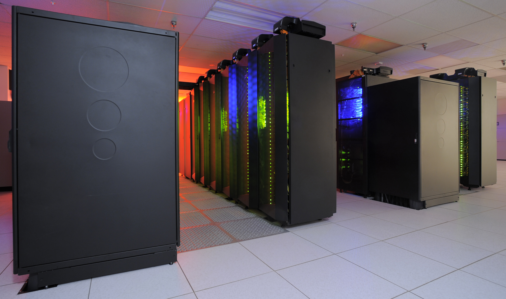 <!-- .element height="200px" style="margin: -45px" -->

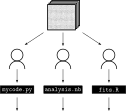 <!-- .element style="margin-top: -15px;" -->

 <!-- .element height="120px" style="margin-left: 20px; margin-right: 20px; margin-top: -45px; margin-bottom: -45px" -->
 <!-- .element height="120px" style="margin-left: 20px; margin-right: 20px; margin-top: -45px; margin-bottom: -45px;" -->
 <!-- .element height="120px" style="margin-left: 20px; margin-right: 20px; margin-top: -45px; margin-bottom: -45px;" -->

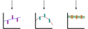

Script:
Data analysis is potentially the area that
the most researchers in lattice work on directly.
Most simulation and measurement codes have multiple core developers,
plus additional users who may occasionally contribute code.
Data analysis however more frequently involves
each researcher having their own preferred set of tools
that they have build themselves.

-

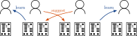

Script:
This is a great reason to share your workflows publicly.
More pairs of eyes on your work will reduce the chances for
errors to slip in undetected, 
and more public examples of workflows allows
you to learn from others' good practices.

-

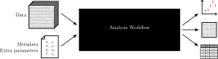 <!-- .element class="fragment current-visible" -->

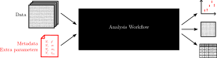 <!-- .element class="fragment current-visible" -->

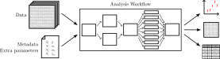 <!-- .element class="fragment current-visible" -->

Script:
The overriding principle of making your analysis workflow reproducible is 
to remove as many manual steps from it as you possibly can. 
Every time you make an adjustment by hand,
there is the possibility that you will make an error&mdash;or,
if you document what you've done,
that someone following these instructions will interpret them differently than how you intended.
[click]
This doesn't mean that you have to have the analysis completely fixed
before you run it across your data for the first time,
or decide up front what parameters will be used or how to compute them.
But you should have a way of specifying these in data,
and re-running the analysis with the updated parameters,
rather than reaching in to make changes by hand part-way through.
[click]
And this doesn't mean that your analysis has to be a single program
that does everything.
Your analysis should almost certainly have multiple parts working together,
but it should have a single button to run the analysis end-to-end.
We'll talk more shortly about how to achieve this.

-

 <!-- .element width="800px" class="fragment current-visible" -->

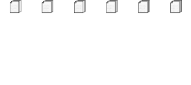 <!-- .element width="800px" class="fragment current-visible" -->

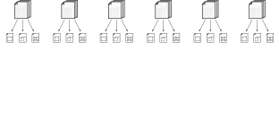 <!-- .element width="800px" class="fragment current-visible" -->

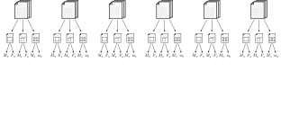 <!-- .element width="800px" class="fragment current-visible" -->

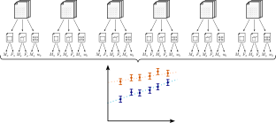 <!-- .element width="800px" class="fragment current-visible" -->

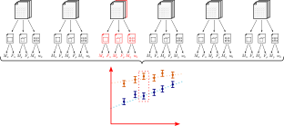 <!-- .element width="800px" class="fragment current-visible" -->

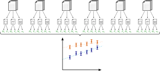 <!-- .element width="800px" class="fragment current-visible" -->

Script:
[click]
A typical lattice computation will involve
[click] more than one ensemble.
For each of these ensembles,
you'll most likely
[click] compute more than one kind of measurement.
Each of these measured quantities needs
to have the right statistical analysis applied to get
[click] a result for one or more observables.
Then,
[click] most likely you will want to combine observables from each ensemble
into an overall analysis.
[click]
What happens when you add or update an output file,
or change a fitting form?
We need to regenerate every datum that depends on the thing that we've changed.
But ideally,
we'd not want to re-run the _entire_ analysis,
because a lot of things haven't changed,
so re-computing them will waste our time waiting for the result.
And since computers are more parallel than ever,
wouldn't it be nice if multiple elements of the analysis could run at the same time?

-

[ <!-- .element height="200px" class="margin50" -->](https://www.gnu.org/software/make/)
[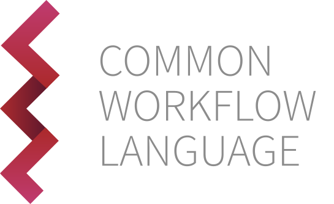 <!-- .element height="200px" class="margin50" -->](https://www.commonwl.org)

[ <!-- .element height="200px" class="margin50" -->](https://snakemake.github.io)
[ <!-- .element height="200px" class="margin50" -->](https://www.nextflow.io)

Script:
The solution to this problem is to use a _workflow manager_.
This is a piece of software specifically designed
to co-ordinate other programs running:
you define steps that need to occur and what dependencies they have,
and the workflow manager works out what order they need to occur in,
and what can run concurrently,
and then runs everything.
Most workflow managers will define their own language or syntax
with which to specify what your workflow steps are
and how they relate to each other.
Examples to look at include GNU Make,
Snakemake,
and Nextflow,
each of which has its own syntax.
The Common Workflow Language,
or CWL,
is another option;
rather than being a workflow manager itself,
it only defines the syntax,
and leaves it up to others to implement&mdash;for example,
Snakemake is able to run workflows defined in CWL.
Since you want to automate the process of running your analysis end to end,
if you don't make use of a workflow manager,
you're likely to end up trying to implement the features of one yourself.
And separating out the definition of how your tools interact with each other,
rather than having everything tightly coupled like spaghetti,
can help others reading your workflow understand how it works.

-

 <!-- .element height="200px" -->

$\swarrow$

$\searrow$

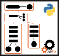 <!-- .element style="margin-left: 100px; margin-right: 100px;" class="fragment" data-fragment-index="2" height="200px" -->
 <!-- .element style="margin-left: 100px; margin-right: 100px;" class="fragment" data-fragment-index="3" height="220px" -->

Script:
What if we already have a substantial volume of tightly-coupled code?
In this case a workflow manager like Snakemake,
that works at the level of programs,
may not be as immediately useful.
We have a couple of choices if we still want to reap the benefits of workflow management.
[click]
One option is to adopt a language-specific workflow manager,
that we can work into our existing code.
For example,
in Python,
[JobLib](https://joblib.readthedocs.io)
and [AiiDA](https://www.aiida.net)
are examples of these.
[click]
Another option is to gradually carve off pieces of functionality into separate programs,
and use Snakemake to handle the plumbing between them.

-

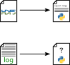 <!-- .element height="500px" -->

Script:
We discussed in the video on measurement code the desire to use
standardised formats for structured data
rather than log files.
If all of the data we are analysing are using a standard format,
then we should be able to load them into our analysis tool
with a single function call to a common library.
But since we can't always write the exact measurement code we want,
sometimes we will need to work with log files generated by someone else's code.
How do we do this in a maintainable way,
that others will be able to understand?

-

 <!-- .element height="340px" style="vertical-align: middle; margin-right: 100px;" class="fragment" -->
 <!-- .element height="120px" style="vertical-align: middle; margin-left: 100px;" class="fragment" -->

Script:
We have a couple of choices.
[click]
One is to write a function that parses the log file,
and returns the data structure that the analysis code expects.
This minimises the number of separate tools you need to co-ordinate,
and the number of intermediary files,
but can introduce some complexity to your analysis,
as now you need to keep track of what file format you're working with.
[click]
Another option is to write a standalone tool
that transforms from the log format
into a more standard format that your code can read directly.
You can then add the tool as an extra rule in your workflow manager,
which can make sure that each file is converted if and when it needs to be.
This saves some complexity from your analysis tool,
at the expense of some complexity in the workflow,
and some more disk space usage.
Either way,
it's a good idea to keep the reading separate from the computation.
It means each component can be re-used in other situations,
and makes each function easier to read,
as it's doing fewer things.

-

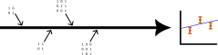 <!-- .element height="120px" style="margin-left: 50px; margin-right: 50px;" class="fragment" -->
 <!-- .element height="120px" style="margin-left: 50px; margin-right: 50px;" class="fragment" -->

Script:
As well as automating all of the steps in our analyses,
we also want to take care of the [click] provenance and [click] integrity of our data.
We've talked about tracking provenance in other videos,
but what about the integrity?

-

 <!-- .element height="500px" class="fragment current-visible" -->

 <!-- .element height="500px" class="fragment current-visible" -->

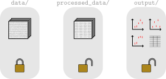 <!-- .element height="500px" class="fragment current-visible" -->

Script:
A key principle to try and follow when working with data
is to keep the raw data raw,
and not modify them.
Ideally,
this means keeping the raw input data in a read-only directory.
Any data files produced by your analysis,
for example,
converted versions of input data files,
or intermediary results,
should be kept in a separate directory.
For example,
you might want to have a `data` and a `processed_data` directory.
To test your workflow works correctly end-to-end,
[click]
you can then delete the processed data directory,
not touching the raw data,
[click]
and check that it is correctly regenerated
when you run the workflow.

-

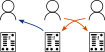 <!-- .element height="200px" class="margin50" -->
 <!-- .element height="200px" class="margin50" -->
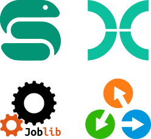 <!-- .element height="200px" class="margin50" -->

 <!-- .element height="200px" class="margin50" -->
 <!-- .element height="200px" class="margin50" -->

Script:
Let's recap now.
We want to share our workflows publicly,
so that we can benefit from more opportunities
to identify and remove potential issues,
and so that others can better understand what we've done,
and learn from where we've done it well.
We want to remove as many manual steps from our workflows as possible,
so that our workflow operates on clearly-defined input data
to always give the same output data.
We want to use a workflow manager to do this,
so that we can more easily organise dependencies
between steps of a complex set of tasks,
automatically run multiple steps in parallel,
and automatically re-run only what is needed when data change.
We want to track the provenance of data where possible,
so it's clear what input data a given output depended on.
And we want to take steps to ensure our data integrity,
including keeping input data separately from modified data,
so that the input data are never accidentally modified.

-

 <!-- .element height="250px" class="margin100side" -->
 <!-- .element height="250px" class="margin100side" -->

Script:
We also want to make sure that
the presentable output from our workflows is reproducible.
For example,
plots and tables
are an important part of any analysis workflow.
Since this is a large topic in itself,
we'll save that discussion for its own video.
