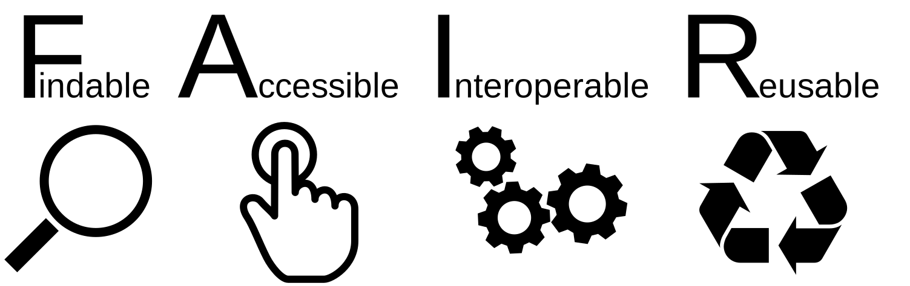

Script:
In the first video of this section, we discussed some of the reasons for open science as a whole, as well as why reproducibility is both vital and intrinsically linked with open science. In this video we'll look more closely at why open data is important for lattice, before looking in more detail about some of the ways that you can support and benefit from it in your work.

---

<!-- .element data-transition="slide-in fade-out" -->

Script:
Computations in lattice field theory typically take relatively small amounts of input data, then use very large computational resources to generate very large amounts of intermediary data&mdash;gigabytes or terabytes of field configurations&mdash;and then distill these down to a handful of points with error bars to appear on a plot. When we look to make data open, we have a number of options available.

-

<!-- .element data-transition="fade-in fade-out" -->

Script:
Firstly, we can share the input data&mdash;the physical and algorithmic parameters used to set up our computations. Since our workflows are fully computational so can (in an ideal world) be reproduced end-to-end, this is effectively the same as distributing all of the other data products, just very highly compressed. However, this runs counter to the spirit of the guidance from research funders and the principles of Open Science. The majority of the resources used in a project are likely to be in the computation performed on these input data; while important for reproducibility, this approach does not give very much help to others looking to build on your work and make most effective use of the limited resources available to us.

-

<!-- .element data-transition="fade-in fade-out" -->

Script:
Bearing this in mind, we can also share the data that we present in our papers. If others want to quote our results, reanalyse them, or comapre them with others', then having to try and read numbers off a graph makes this far more difficult (and imprecise) than it needs to be. Putting a data table into the paper can help with this, but becomes more impractical as the number of data points on plots grows, and raises the risk of copy and paste error. Better is to release the data in a machine-readable format&mdash;we'll come back to that in more detail later in the video. Sharing this will already increase the reach and impact of your work.

-

<!-- .element data-transition="fade-in slide-out" -->

Script:
However, just releasing the input and final output data will leave a lot on the table. The ensembles of field configurations generated for one computation will contain far more information than one group of authors could get out of it. Sharing these allows others to study observables that were outside the scope of the original work, but still of interest to others. Even if only correlation functions and other intermediary data are shared, this still permits investigation of channels, excited states, and fitting techniques that were not used in the original work, as well as being able to verify that the original analysis techniques give the stated results and give a better understanding of what the underlying data do and do not say, preventing misunderstandings. When a large telescope takes observations of a particular star for a particular research group, the images taken are (after a suitable delay) made available openly, as many other stars will appear in the field, and the telescope is too valuable to throw away large amounts of the data it generates; there is no reason the same should not be true for lattice data coming from HPC facilities. This will in turn allow your data to potentially generate far more publications than it would if it were kept private. 

-

## Simplification warning

 <!-- .element width="600px" -->

Script:
A final reminder before we dive into the details that we're barely going to scratch the surface of this space in this video. Check back on the section page for links to more detailed resources on specific topics.

---

[ <!-- .element: width="1200px" -->](https://www.go-fair.org/fair-principles/)

Script:
Before we talk about releasing our lattice data, we need to introduce some key terms, to frame the decisions that we'll be making about how to do this. The primary standard by which open data is judged by is whether it is FAIR; that is, Findable, Accessible, Interoperable, and Reusable. Data don't have to be open to be FAIR&mdash;you could imagine securely holding sensitive presonal data, and authorised users will still need to be able to find it, access it, have it work with other data, and use it in different pipelines than the one it was first analysed with. But if data are not FAIR, then they have less value&mdash;for example, if no one can find data, then there is little point in it having been released.

-

 <!-- .element: width="200px" -->

- F1. (Meta)data are assigned a globally unique and persistent identifier <!-- .element class="fragment" -->
- F2. Data are described with rich metadata <!-- .element class="fragment" -->
- F3. Metadata clearly and explicitly include the identifier of the data they describe <!-- .element class="fragment" -->
- F4. (Meta)data are registered or indexed in a searchable resource <!-- .element class="fragment" -->

Script:
Speaking of findability, let's look at the FAIR guiding principles in more detail, starting with findability. [click] First up is the need to assign data and metadata a globally unique and persistent identifier, or PID. A hyperlink to a GitHub repository or University-hosted web page isn't sufficient here, as GitHub usernames change and universities restructure their web presence, which will render all prior references to the data no longer usable. The most commonly used PID is the Digital Object Identifier or DOI, which most journals will assign to papers, and the arXiv also assigns to preprints. [click] It's also important for data to be described by rich metadata. For example, if I want to find all data generated with a specific lattice action and value of the coupling, then I should be able to. [click] The metadata should also include the identifier of the data that they describe. Since data can be large and very difficult to index, and metadata tend to be small and need to be searchable (and hence indexed), it is common to store metadata separately from the data they describe. In this case, being able to make the link between the two is vital; it isn't useful to find the metadata describing exactly the data you need, but then have no way of finding the data from that point. [click] Finally, metadata should be registered or indexed in a searchable resource. If each researcher tags their data with metadata but keeps it in a different location to every other researcher, then a potential user of the data will have no idea where to go looking.

-

 <!-- .element: width="200px" -->

- A1. (Meta)data are retrievable by their identifier using a standardised communications protocol <!-- .element class="fragment" -->
  - A1.1 The protocol is open, free, and universally implementable <!-- .element class="fragment" -->
  - A1.2 The protocol allows for an authentication and authorisation procedure, where necessary <!-- .element class="fragment" -->
- A2. Metadata are accessible, even when the data are no longer available <!-- .element class="fragment" -->

Script:
Data and metadata being findable isn't useful unless they can also be accessed. [click] Firstly, given the identifier of some data or metadata, we need to be able to retrieve them using a standardised protocol. For metadata this is likely to be HTTP, but for larger data, there is usually a preference for other protocols that are better optimised for transferring large files efficiently, such as GridFTP or UDT. [click] Whatever protocol is used, it should be open, free, and universally implementable&mdash;a protocol that is only implemented by a single piece of proprietary software is not good enough. [click] Most facilities capable of storing the volumes of data generated in lattice computations are not keen on allowing global anonymous access to their resources; as such any protocol used for retrieving data will need to support authentication and authorisation. This also enables collaborations to share internal data in a FAIR way before they are ready to release them openly, since access controls can be used to limit who can use the data. [click] Finally, the metadata describing our data should remain available even if the data no longer are. Data are large enough that it can be impractical to store them for long periods of time; due to constraints on funding, or simple hardware failure, the older the data, the less likely it is to still be there. However, references to the dataset in literature should still resolve to something useful in this event; rather than having a bare identifier with no context, being able to see the metadata of the data that are no longer available at least allows an understanding of what was being used, even if it can no longer be accessed to use again.

-

 <!-- .element: width="200px" -->

- I1. (Meta)data use a formal, accessible, shared, and broadly applicable language for knowledge representation.
- I2. (Meta)data use vocabularies that follow FAIR principles
- I3. (Meta)data include qualified references to other (meta)data

Script:
Next, we would like data and metadata from different sources to be able to interoperate and be used together. Without this, it is much harder for anyone else to build tools that work with it. [click] A step towards this is to use a common language for representing data&mdash;where possible, rather than inventing a new file format or data layout, using a commonly-used one will make the data much easier to work with. [click] They should also make use of existing vocabularies; if two datasets from different groups describe a quantity as "beta", it should be clear whether they are referring to the same quantity or not. Of course, if the vocabularies used are not themselves available openly under FAIR terms, then this will not provide as significant a benefit as it otherwise could. [click] Finally, data and metadata should make reference to other data and metadata where appropriate. For example, data describing measurements should refer back to the ensembles that were used, which will make it clear whether two different measurements at the same physics parameters used the same or different underlying ensembles.

-

 <!-- .element: width="200px" -->

- R1. (Meta)data are richly described with a plurality of accurate and relevant attributes
  - R1.1. (Meta)data are released with a clear and accessible data usage license
  - R1.2. (Meta)data are associated with detailed provenance
  - R1.3. (Meta)data meet domain-relevant community standards

Script:
Last we don't share data just to be admired, but to be reused. [click] There are a number of different requirements to enable data to be reused. We've already discussed having full metadata&mdash;we can't easily reuse gauge configurations without knowing the physics parameters they represent, for example. Other, more specific requirements include [click] making sure that you specify a license for data&mdash;we discuss copyright in more detail in the video on open-access publications, but the short story is that unless you give explicit consent, nobody is actually allowed to do anything with the data you share (since this would require making a copy of the data to their machine, which requires being given permission). Appropriate licenses for data are the same Creative Commons licenses that are commonly used for publications. [click] Another aspect not to forget is the provenance of your data&mdash;when were the data made, by whom, what inputs were used, what processes or tools were used. We'll talk more about how to achieve this when we discuss reproducibility. [click] The data and metadata you publish should also meet standards relevant to the community. For example, we'll shortly discuss the International Lattice Data Grid, which defines standards for sharing gauge field configurations and their associated metadata. If you ignore these standards and publish in your own ad-hoc way, it becomes much harder for others to reuse your data using standard tooling, and interoperate them with others' data.

---

Script:
Now let's discuss some specific recommendations for sharing data from your lattice simulations. We've already suggested that where possible, all classes of data from your simulation should be shared&mdash;including input parameters and output data with error bars, but also field configurations and observable measurements on them (which usually act as input to code to assemble statistics and perform fits). Depending on what resources are available near you, there may not be sufficient capacity to store field configurations and make them available; in this case it's even more important to share the intermediary observable measurements&mdash;think of things like plaquettes and Polyakov loops, correlation functions, gradient flow and topological charge histories.

-

 <!-- .element width="600px" -->

Script:
Firstly, let's talk about what formats to use to share our various classes of data. For data that naturally lie in columns, a good choice is the Comma-Separated Values, or CSV format. In particular, any data that you present in tables and plots are likely good candidates to be represented in CSV format. One approach is to have one CSV file for each plot or table in a given publication, but if you have many similar plots or tables, then it is probably more useful to combine these related data into a single file.

-

| $\beta$ | $V$ | $am$ | $aM_\pi$ |
| --- | --- | --- | --- |
| 2.05 | 24$\times$12³ | -1.475 | 0.9733(23) |
| 2.05 | 32$\times$16³ | -1.49 | 0.9035(16) |
| 2.05 | 48$\times$24³ | -1.523 | 0.5412(25) |

| $\beta$ | $V$ | $am$ | $a\sqrt{\sigma}$ |
| --- | --- | --- | --- |
| 2.05 | 24$\times$12³ | -1.475 | 0.378(19) |
| 2.05 | 32$\times$16³ | -1.49 | 0.379(44) |
| 2.05 | 48$\times$24³ | -1.523 | 0.2354(56) |

<!-- .element: style="float: left; width: 35%; font-size: 28px;" -->

<pre style="box-shadow: none;">
beta,nt,nx,ny,nz,am,aMpi_value,aMpi_error,asqrtsigma_value,asqrtsigma_error
2.05,24,12,12,12,-1.475,0.9733088,0.0023119,0.377432,0.019131
2.05,32,16,16,16,-1.49,0.9035208,0.0015835,0.379415,0.044412
2.05,48,24,24,24,-1.523,0.5124164,0.0024928,0.2353982,0.0055882
</pre>

<!-- .element: style="float: right; width: 60%; font-size: 32px; margin-top: 200px" -->

Script:
If you're not familiar with CSV, it is a plain text format, where rows are separated by newline characters, and columns are typically separated by commas. Variants also exist that use other characters for their delimiters, in particular in countries where a comma is a decimal separator. This is one reason it is important to use a standardised schema where possible, and to include enough metadata to allow others to reliably work with your data. For example, if you have tables of state masses for particular ensembles, these can be combined into a single CSV, with columns for each of the quantities identifying the ensemble and for each quantity. You can include more significant figures in a CSV than it would be sensible to include in a table. The value and the uncertainty should be presented separately. Sharing data in this form will make it significantly easier for anyone wishing to quote your values in their own analysis to do so without loss of precision.

-

 <!-- .element width="800px" -->

Script:
For storing large amounts of data&mdash;for example, Monte Carlo histories of observables like plaquettes or correlation functions&mdash;CSV is not such a good choice, since it uses more space that is needed, and is not fast to read in as numbers must be parsed into the appropriate binary representation. Instead, for larger data like these, you should use a dedicated format like HDF5. These will store the data in binary format, so they are more compact on disk and quicker to read into memory. They also offer other advantages: they have optimised implementations available for most operating systems and languages, which makes them give better performance than writing your own format, and they also support a more rich structure within the file.

-

TODO IMAGE

Script:
When using HDF5, you should make sure to use an appropriate binding for the language you're working with. For example, `h5py` in Python provides a convenient interface. The "H" in "HDF5" stands for "hierarchical"; HDF5 in fact implements its own file system internally, allowing you to store many datasets in a single file. For example, if you had data for multiple ensembles, or multiple different sets of data for one ensemble (like the plaquette, mesonic, and baryonic correlation functions), then you could combine these all in the same file, so others could download your full dataset in a single file. The HDF5 file system also allows the same dataset to appear in multiple locations without duplication of data. So you could present your data organised both by ensemble and by observable, without consuming additional storage. HDF5 is also good for data with more than two dimensions, which could be hard to represent as a CSV; HDF5 supports higher-dimensional arrays, and using `h5py` these can be constructed very easily from Numpy `ndarray`s of any dimensionality.

-

<!-- .element width="800px" -->

Script:
When it comes to sharing gauge configurations, then the standardised format to use is the one defined by the International Lattice Data Grid. Most lattice software suites have their own formats for saving configurations to disk, but frequently these are specific to certain software packages that designed them. The ILDG configuration format is well-defined such that users of different software to that which you might have used to generate the configuration can easily either load it directly or convert it to a format their software supports. The binary format is only a small aspect of the ILDG; we'll talk in more detail about how to use it in a separate video.

-

 <!-- .element width="500px" -->

Script:
A key principle of working with data is that where possible you do not modify it (and in particular you do not modify raw data) in place. This also applies to sharing the data&mdash;ideally, you would like to share the data with as little manipulation done to it as possible, to reduce the possibility that problems could be introduced, or useful data removed.

-

 <!-- .element width="200px" -->

 <!-- .element: style="float: left; width: 45%;" -->

 <!-- .element width="200px" -->

 <!-- .element: class="fragment" style="float: right; width: 45%; margin-top: 200px;" -->

Script:
However, we still want to share data in open, documented, easily-readable formats, which might not be the same as what our code outputs. There are two approaches to dealing with this: firstly, one can share both the original raw data (for example, text logs from a measurement tool), and the data converted to a common format like HDF5. You should do this conversion in an automated way, with the tooling also published, so the process can be understood by the interested reader. This approach is particularly useful if you have already produced a volume of data in a proprietary format that you want to share, or if you have mature tooling that would be impractical to adjust. The second approach, which is likely better in the long term, is to redevelop your tooling to use the same open formats that we would like to share our data in. Rather than outputting only a LaTeX table, your tabulation code can also generate a CSV; rather than outputting only a text log, your measurement tools can also output to HDF5.

-

 <!-- .element width="400px" style="margin-bottom: 100px" -->

 <!-- .element height="100px" style="margin-left: 100px; margin-right: 100px; vertical-align: middle;" class="fragment" -->   <!-- .element height="100px" class="fragment" style="margin-left: 100px; margin-right: 100px; vertical-align: middle;" -->   <!-- .element height="60px" class="fragment" style="margin-left: 100px; margin-right: 100px; vertical-align: middle;" --> 

Script:
Now that we know what data we want to share, we need to know where to share it. The key aspect here is to use a dedicated data repository. A general-purpose data repository that is free for all to use is Zenodo. Zenodo is hosted by CERN, and commits to making your data available as long as it is active, which is planned to be at least as long as CERN has a datacenter. This is a lot longer than services like GitHub or GitLab commit to hosting your data. Zenodo also provides you with a DOI for your data, meaning that you can link to it from a publication without worrying that the link will become invalid in the future&mdash;as long as Zenodo is still active, the link will resolve correctly. Including the DOI in your narrative publications as a citation helps readers to be able to find your data. There is a limit on the size of a Zenodo record&mdash;the standard limit is 50GB, although if you need to exceed this slightly you can speak with them to request an exception. If your data are much larger than this, then this is a sign you need a more specialised repository, for example the ILDG for gauge configurations. Don't try to split your data across a large number of Zenodo records to bypass the limit&mdash;this is likely to get you banned! This is also an area where you should check your institutional policy&mdash;you might find that your local institution runs its own data repository that it prefers you to use. (For example, the University of Bielefeld runs a service called Unibi where data can be deposited.)

-

 <!-- .element width="800px" -->

Script:
Finally let's talk about what metadata we should include with our data. If there is a metadata schema defined, you should definitely use it. A metadata schema gives a template for what metadata must be included with a particular class of data, as well as what can optionally be included, and how to format both of these such that they can be read by the same software as will read metadata from any other collaboration. We'll talk in another video about the ILDG's metadata schemas for ensembles and configurations; outside of this there are currently few schemas relevant to lattice. In the absence of a schema, you need to think carefully about what questions others might have about your data, or what they would need to know to be able to use it effectively. It's impossible to give an exhaustive list here (that would essentially be a metadata schema), but we can define some broad areas to think about.

-

## Metadata for the whole dataset

- Who created it?
- When was it created
- Who uploaded it?
- When was it uploaded?
- Who paid for it?
- Who else contributed?
- What work does the dataset build on?
- What dependencies does the dataset have?
- What work was the dataset created to enable?
- What rights does a user of the dataset have?

Script:
One area to consider is metadata about the dataset as a whole. This includes questions like... Usually your data repository will prompt you for many of these.

-

## Metadata for measurements

- Who ran the computations?
- What ensembles/configurations were used?
- What code was used? Which version?
- When was the measurement performed?
- What computer was used?
- What parameters were passed to the program?
- What observables have been measured? How are they defined?
- Was smearing used? What kind? How much?

Script:
When sharing the results of measurements, it is particularly important to not only share a block of numbers. For the numbers to be useful, a user will need to know things like... We'll talk more about how to keep track of some of these things automatically when we talk about reproducible workflows.

---

## Key points

- Use a repository
- Add a license
- Use common formats
- Include sufficient metadata
- Cross-link to relevant work

Script:
That's a lot of information to take in at once, so let's sum up some key points. Publish your data in a dedicated data repository, with a license that allows people to make use of it. Use commonly-understood data formats like ILDG, CSV, and HDF5, and make sure you include enough metadata for others to be able to make sense of it. Finally, once it's published, cite your data releases from narrative publications that rely on the data (and vice-versa) so that people can find one from the other.
