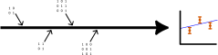
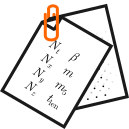
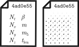
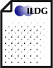

Script:
Dynamical field configuration generation is frequently the most expensive part of a lattice computation&mdash;in terms of money, energy, computing time, and carbon emissions, for example. The resulting configurations may be used to compute many different observables, by many collaboration members or other groups, rather than each generating equivalent configurations afresh. Because of this, we want to be sure that they are generated correctly and reproducibly.

-

<div class="r-stack">

 <!-- .element class="fragment fade-out" -->

<div class="fragment">

 <!-- .element style="margin: 50px;" width="300px" -->  <!-- .element class="fragment" style="margin: 50px;" width="300px" -->

</div>
</div>


Script:
Most HPC systems impose a time limit on the length of jobs&mdash;see the Hardware and Software section to understand why this has to be the case. The majority of non-trivial ensembles can't be fully generated within the time limit of a single job, and so we need to checkpoint. [click click] Frequently we will already output the field configuration after one or more Monte Carlo updates to be able to compute observables; this can also be used as a checkpoint from which to resume generation of configurations later. However, this isn't the only state in the software&mdash;[click] the random number generator also carries a state, that we set up with a seed at the beginning of the program. We need to persist this state along with the field configuration; if this is not done, then in the best case the next job will seed the generator in such a way that we can't reproduce it.

-

[image tbc]

Script:
In the worst case, the generator will be re-seeded with the same seed that was used at the start of the ensemble, which will introduce noticeable autocorrelations into the ensemble.

-

<div class="r-stack">

 <!-- .element class="fragment current-visible" -->

 <!-- .element class="fragment current-visible" -->

</div>

Script:
So the field configurations saved in order to compute observables do not on their own make a complete checkpoint. But does a complete checkpoint provide all the necessary information to usefully retain the configurations long term? [click] No, the raw binary data of the field configuration cannot by itself provide enough information for others to be able to make use of it. Let's explore why.

-


&mdash;[CC BY-SA Trio3D](https://commons.wikimedia.org/wiki/File:Three_stages_of_disc_rot_(PDO_UK).png)

Script:
Computer hard drives, SDs, backup tapes, and cloud storage will generally not hold a perfect record for eternity of every single bit of data you store. Over time, degradation of the material, manufacturing defects becoming apparent, and environmental factors (up to and including passing cosmic rays flipping bits) can all cause data to be modified on disk. Because of this, configurations we store should always include a way of verifying that the data we read are the same as those that were written in the first place.

-

```shell
$ crc32 ckpoint_lat.1000
984a7d88

$ md5sum ckpoint_lat.1000
612e7d681a509a7d182309a3373e239c  ckpoint_lat.1000

$ sha256sum ckpoint_lat.1000
64c98c02f9cc060c487fba55f69c93893dde056eea8a0048962f7c2fcb862feb  ckpoint_lat.1000
```

Script:
A checksum is an algorithm that takes every byte of information in a data structure and transforms them into a single, relatively short number&mdash;no more than a few bytes. The algorithm is chosen such that the most common data integrity problems, like bit flips, or transpositions of adjacent bits or bytes, give an entirely different result. This means that random changes to the data are very unlikely to give a correct checksum, so corrupted files can be efficiently excluded. (The same principle is applied in credit card numbers and barcodes, where the last digit is a "check digit" to ensure that the remainder of the number has been correctly entered.)

-


Script:
Other observables frequently used to check consistency include the average (spatial, tempoeral, or global) plaquette, and the trace of all gauge links. While these are less likely than a checksum to identify an individual bit flip, their greater physical interpretability means they can help identify whether the structure of a configuration has been read correctly; since the checksum only looks at the raw binary data, it cannot verify this.

-

<div class="r-stack">

 <!-- .element class="fragment current-visible " -->

 <!-- .element class="fragment current-visible" -->

 <!-- .element class="fragment current-visible" -->

 <!-- .element class="fragment current-visible" -->

</div>

Script:
Even with checksums in place to guard against data corruption, a field configuration is nothing more than a sequence of meaningless numbers without having metadata to describe it. To start interpreting them, you'll need to know [click] their data type, then [click] what matrix structure the numbers are arranged into, and [click] the dimensions of the lattice, and the ordering on each index, to arrange these matrices into a lattice. Some of this information will be defined as part of the file format specification, but much of it will be different for each ensemble.

-

- $S$ <!-- .element class="fragment" -->
- $\beta$, $m$ <!-- .element class="fragment" -->
- $c_\mathrm{SW}$, $L_5$ <!-- .element class="fragment" -->
- $n_\mathrm{MC}$ <!-- .element class="fragment" -->
- $n_{\mathrm{chain}}$ <!-- .element class="fragment" -->

Script:
And once a configuration can be read in, we're still not done. To be able to use the configuration in our analysis, we need to know the parameters used to generate it&mdash;things like [click] what action was used, and [click click] any parameters input into the action (like couplings and masses), as well as [click] the configuration's position in Monte Carlo time (to be able to correctly account for autocorrelations in the data). If multiple Monte Carlo streams are generated in parallel (i.e. with different random seeds, but all other parameters the same), then [click] which Markov chain the configuration belongs to should also be identified.

-

 <!-- .element width="500px" -->  

 <!-- .element class="fragment margin50 vcentre" -->  <!-- .element class="fragment margin50 vcentre" -->  <!-- .element class="fragment margin50 vcentre" --> 

 <!-- .element class="fragment margin50 vcentre" --> 
 <!-- .element class="fragment margin50 vcentre" -->
 <!-- .element class="fragment margin50 vcentre" -->

Script:
As we've discussed previously, in addition to metadata about what physics is represented by the data and how to make use of them, it is also valuable to provide metadata on the provenance of the data&mdash;how they came to be produced. For example, for each configuration you may want to know [click] what machine it was generated on, [click] a timestamp of when it was generated, and [click] the username or other identifier of the person who submitted or ran the job. This can guard against errors in other metadata&mdash;if configurations with small Monte Carlo time index were generated after those later in the chain, they may in fact come from separate Markov chains. It's also useful to have a record of [click] which version of a code was used (with an indication of whether uncommitted changes are present), [click] what options it was compiled with (particularly if this controls the physics to be studied), and [click] what input was passed to it.

-

 <!-- .element height="350px" -->

 <!-- .element class="fragment margin50" height="150px" -->
 <!-- .element class="fragment margin50" height="150px" -->


Script:
It's important to use a format that keeps all of the metadata in a way that is easy for code to work with, and that can't easily be disconnected from the configuration. For instance, the filename is not a good place to keep metadata&mdash;it isn't machine readable, and files can get renamed accidentally and the original metadata lost. Metadata can be embedded within the binary configuration file, or stored in a second file linked back to the binary configuration somehow (for example, referring to an identifier within the binary).

-

 <!-- .element class="fragment margin50" height="100px" -->

 <!-- .element class="fragment margin50 vcentre" height="100px" --> <span class="margin50"></span>
 <!-- .element class="fragment margin50 vcentre" height="130px" -->

Script:
You also need to use a format that is carefully specified, so that configurations can be reliably read in again later. For example, [click] what order are the bits and bytes stored in inside a number? Some machines store the most significant bit first, others the least; this is called _endianness_ (big-endian or little-endian). [click] What ordering are the sites laid out in? That is, does the structure look at all $t$ values for a given $x$ consecutively, or keep $t$ fixed first and scan over $x$? [click] And are the links associated with a site ordered the same way? If not documented, anyone trying to use your configurations will have to guess these things until they read a configuration that "looks" right.

-



Script:
A way to avoid needing to write a lot of documentation is to use a format that is already very well documented. The International Lattice Data Grid (ILDG) has a documented schema for metadata, where you only need to fill in the blanks, and also provides an associated binary specification that is similarly well documented and widely supported.

-

 <!-- .element height="200px" class="fragment margin50 vcentre" -->
 <!-- .element height="70px" class="fragment margin50 vcentre" -->
 <!-- .element height="200px" class="fragment margin50 vcentre" -->
 <!-- .element height="200px" class="fragment margin50 vcentre" -->

Script:
Let's recap. To generate your field configurations reproducibly, you should [click] make sure to persist your random number generator state along with your field configurations. [click] Store checksums and simple physical observables along with the configuration to verify that data have not become corrupted. [click] Include metadata and provenance information with your configuration, either within the binary file or in a separate file connected to the binary file via a unique identifier. [click] And use a well-defined and documented file format for both your binary configuration data and the associated metadata; the ILDG format provides this with the minimum amount of work needed from you.
