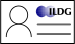

$O(\textnormal{1 GiB})$

$O(\textnormal{100 GPUh})$

$O(\textnormal{1 TiB})$

$O(\textnormal{100 kGPUh})$

Script:
To recap what we've discussed in other videos about field configurations: they can be large objects, and when you have full ensembles of them the accumulated set of them is even larger. They also take significant amounts of computing time to generate, so we want to ensure that the maximum value can be extracted from them.

-

<!-- .element data-transition="slide-in fade-out" -->

Script:
Imagine that a group has generated an ensemble of configurations, and used it to extract the masses of certain states. This is a huge data reduction step; there is likely to be far more information in the ensemble than just those state masses. But if they don't share their configurations, then unless the original research group has the time and skill set to pursue every possible angle on the data, then the additional information encoded within is unlikely to be found.

-

<!-- .element data-transition="fade-in slide-out" -->

Script:
However, if they share their configurations with the world, then other groups can much more easily investigate other observables. Perhaps they can extract additional channels, or excited states, or apply different analytical techniques to obtain more precise results, or even study different observables altogether.

-

|  <!-- .element height="72px" style="vertical-align: middle;" --> |  <!-- .element height="72px" style="vertical-align: middle;" --> | 📧 |  <!-- .element height="72px" class="fragment" data-fragment-index="2" style="vertical-align: middle;" --> |
| :-: | :-: | :-: | :-: |
| ❌ | ❌ | ❌ | ✅ |

Script:
But how can we share our ensembles with others when they are so large? Zenodo and the arXiv can't accept files that large; even if we resorted to email we still couldn't send files that big. Not even file transfer services like Dropbox are designed for that volume of data. [click] This is the challenge that the International Lattice Data Grid is designed to solve.

-

 <!-- .element height="200px" style="vertical-align: middle; margin: 150px;" -->  <!-- .element width="200px" style="vertical-align: middle; margin: 150px;" -->

Script:
So I can just throw my petabytes of configurations at the ILDG and they'll host them, right? Unfortunately not, ILDG does not have infinite money to run storage services with. In fact, ILDG runs very few services themselves; what they do is provide a Virtual Organisation (or VO) that allows for identity management, and a set of specifications. Those specifications include a metadata schema and binary file format for gauge configurations, and a set of standards (APIs) that services need to implement to integrate with other ILDG services. The task of deploying such services is left to Regional Grids.

-

 <!-- .element width="1000px" -->

Script:
Currently there have been Regional Grids in the USA, the UK, continental Europe, Japan, and Australia. All of these have had a period of degraded activity where funding was short, but most of them are reactivating and restoring services.

-

| Metadata catalogue | File catalogue | Storage element |
| --- | --- | --- |
| Stores metadata about ensembles, configurations | Maps configurations to file locations | Store binary data |
| One per region | One per region | Potentially many per region |
| Searchable | Searchable | Not easily searchable |

Script:
Each regional grid has three kinds of service: a metadata catalogue, a file catalogue, and one or more storage elements. The metadata catalogue holds details of ensembles and configurations; this includes algorithmic and physical details like what action and parameters were used, as well as provenance information like what machine was used to generate the configuration and on what date. An important aspect is being able to query on these features, to find ensembles that are relevant to your work. The file catalogue holds details of where each configuration is stored; it acts as a mapping from the metadata catalogue to the storage elements. The storage elements hold the configurations themselves. Some regional grids are able to provide some amount of storage centrally, while others need the storage elements to be provided by the research groups looking to share their data. Some regional grids also provide web interfaces to one or more of these services, so you can browse them without needing to authenticate and use the command line.

-

 <!-- .element height="400px" style="vertical-align: middle" -->

Script:
ILDG services provide a single identity, that you can use to query the metadata and file catalogues, download configurations, and upload ensembles. Some of these require your identit to be given specific access rights&mdash;for example, most storage elements need you to be specifically authorised to access them, and you need permission from a research group to upload ensembles under their namespace. However, the identity used is the same throughout.

-

 <!-- .element height="450px" -->

Script:
While ILDG already provides its own forms of persistent identification of ensembles, an area that they are actively working on is being able to provide a Digital Object Identifier to ensembles or collections of ensembles. This will enable these to be more easily cited in publications that use them, and discovered by others.

-

 <!-- .element height="350px" -->

Script:
In this section we've introduced ILDG and discussed at a high level how it works. To get hands-on experience of how querying, downloading from, and uploading to ILDG services works, we'd recommend looking at the ILDG documentation, or attending one of their workshops.
