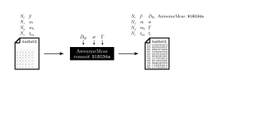
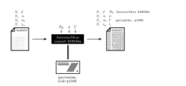
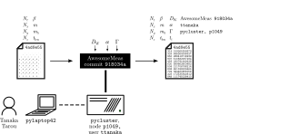
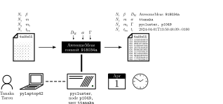
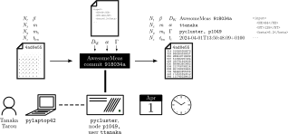
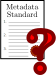
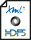
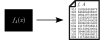

Script:
In this video we're going to be talking about measurement code. By that, we mean code that reads in one or more field configurations and outputs one or more computed properties of each of those configurations. We'll rely heavily on the concepts introduced in the Essentials of Reproducibility for LFT video, so if you haven't watched that, you'll want to go and do that before coming back to this video.

-

Script:
For someone to be able to reproduce your measurement, they need to know what configurations were used. In principle, providing unique identifiers would be sufficient for this, but it is usually convenient to include the full metadata from the original configuration, so that it can be read by the subsequent analysis steps which will likely need information from it, rather than the analysis having to look up the configuration separately.

-

Script:
Tracking the configurations used is one aspect of tracking the provenance of the measurement result. Another aspect is tracking what was done to obtain the results that are output. We also touch on this in the discussion of open data, but it bears repeating: a block of numbers is not useful data. For example, a correlation function can be represented as a one-dimensional list of numbers, but for this to be intelligible and useful (and reproducible), you also need to specify what action and operator were used, what time index each number represents, and any other parameters specific to the algorithm you used&mdash;for example, whether techniques like smearing were used, or where your source locations were. It's not uncommon to use a different lattice action for measurement to gauge field generation, but even if they match, this should still be specified.

-

 <!-- .element class="fragment current-visible" -->

 <!-- .element class="fragment current-visible" -->

 <!-- .element class="fragment current-visible" -->

 <!-- .element class="fragment current-visible" -->

 <!-- .element class="fragment current-visible" -->

Script:
There are some other aspects of provenance that it is valuable to track. For example, as in other cases, knowing the software used and what version is vital to be able to reproduce the work, and also to give credit to others' work if you are not running your own code. [click] Knowing what machine was used can be valuable, for example if it later transpires that the machine had a hardware issue that caused results to be subtly distorted. [click] Knowing who performed a piece of work means you know who to ask if you have questions about reproducing it. [click] Knowing when data were generated is important to be able to perform consistency checks later, and in case there are any disputes around who reached a discovery first. [click] And preserving the full set of input parameters in their original format is invaluable to others wanting to re-run the exact same run that you performed, even if you already have some of the parameters preserved elsewhere in the metadata.

-

<pre>
Starting AwesomeMeas at 2024-04-01 13:50:01
AwesomeMeas commit 918034a
I'm going to read /data/runs/su2/nf1_adjoint/beta2.05/run1_48x24x24x24_n005296.lime... done
The plaquette of this configuration is 6.060480e-01 - the components are 0.606007 0.606294
0.606023 0.606201 0.605699 and 0.606064
Now I'll do some inversions
Oh, QMR inversion didn't work, I'll try MINRES instead
Oh hey, that worked - the residual is 4.98087609e-15, which is less than our threshold of
5.00000000e-15
That took 242 matrix-vector multiplications
Using a valence mass of -1.523, the correlator components of the gamma-5 state are 
2.924033e-04 8.637676e-05 3.818205e-05 1.883472e-05 9.689982e-06 5.155177e-06 2.877850e-06
1.630342e-06 9.110617e-07 5.165134e-07 2.945922e-07 1.685635e-07 9.788209e-08 5.710508e-08
3.314123e-08 1.909234e-08 1.115990e-08 6.259931e-09 3.586201e-09 2.080994e-09 1.211274e-09
6.957276e-10 4.305855e-10 2.965325e-10 2.665802e-10 3.086986e-10 4.332207e-10 6.680444e-10
1.082293e-09 1.840928e-09 3.183385e-09 5.453703e-09 9.401493e-09 1.651578e-08 2.944505e-08
5.108959e-08 8.938169e-08 1.608303e-07 2.829956e-07 4.840165e-07 8.287888e-07 1.491599e-06
2.675054e-06 4.953611e-06 9.268345e-06 1.787148e-05 3.656647e-05 8.569544e-05
That analysis took 6 seconds and 474471 microseconds.
</pre>

❌

Script:
When you're developing a piece of software from scratch, you might start off by having it output its progress in a log file, so you can check that it's working properly. And then, you need to plot some of the results, so you pull the numbers out of the log file. And then you need to publish the results, so you start building a small constellation of scripts to read from these log files. And then you adjust something about the logging, and the tools break in unexpected ways. And you share the data with other people, and they have to write their own set of tools to read them. Using log files as your primary data output format is not a good idea!

-

✅

Script:
Having detailed logs is good, but in addition, data should be output in a data format. Good formats for this include JSON, XML, and HDF5&mdash;these offer more flexibility and structure than a flat format like CSV gives, letting you include rich metadata more easily. HDF5 in particular is better for larger volumes of data, as it is more storage-efficient, and can be read and written in parallel if necessary. All of these formats have good libraries available to read and write them from most common programming languages, which you should make use of&mdash;you should never need to write code to parse the syntax or write it by hand.

-

Script:
In general, it's good to stick to a standardised format and schema for your data and metadata&mdash;this makes it easier for your work to interoperate with others', since there's no need need to work out how to match differently-labeled fields, different conventions on normalisation, and so on. It also makes it easier to not forget to include particular pieces of metadata. Unfortunately, for lattice measurements currently there is no commonly-accepted schema. This means that we all have to make a best effort to include as much metadata as is necessary, and to document this clearly and thoroughly enough that others are able to make use of our data.

-

 <!-- .element class="fragment margin50 margin100side" data-fragment-index="1" height="150px" -->
 <!-- .element class="fragment margin50 margin100side" data-fragment-index="3" height="150px" -->

 <!-- .element class="fragment margin50 margin100side" data-fragment-index="2" height="150px" -->
 <!-- .element class="fragment margin50 margin100side" data-fragment-index="4" height="150px" -->

Script:
To sum up: [click] do preserve in your measurement output the metadata and provenance information from any files you read in. [click] Also, add any necessary metadata and provenance information saying what was done and how; this can include the algorithms used and parameters to them, as well as information like what machine was used and when. [click] Do use data formats like JSON, XML, or HDF5 for outputting data, and make sure that you use appropriate libraries for constructing and parsing these. [click] And carefully document your data and metadata conventions, and keep an eye out for the development of schemas that will standardise this process.
