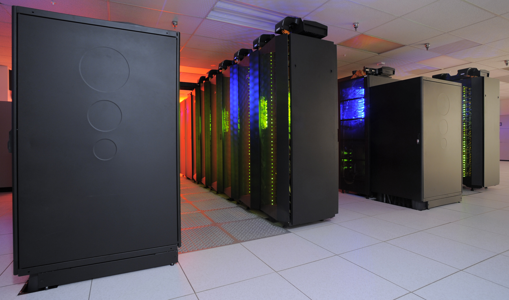
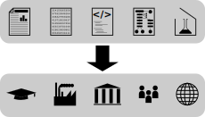

<!-- .slide: data-background-iframe="../../dist/theme/assets/section-header-grey.png" -->
# History

-

[ <!-- .element: width="800px" -->](https://commons.wikimedia.org/wiki/File:Statues_of_Isaac_Newton_and_Gottfried_Leibniz.jpg)

[CC BY 3.0 Andrew Gray, Alexey Gomankov](https://commons.wikimedia.org/wiki/File:Statues_of_Isaac_Newton_and_Gottfried_Leibniz.jpg)

Script:
In this picture we see two brilliant scientists of the seventeenth century: Sir Isaac Newton and Gottfried Leibniz. Both of these people claimed to have invented calculus, and this was a major disagreement both between the two of them, and in the wider scientific community. Of course any dispute of this nature has many causes to it, but a significant one is that in the seventeenth century there was not a culture of publishing scientific findings to be accessible and understandable to the wider community. Instead, the motivation was to secure continued income for the scientist&mdash;by publishing work difficult to understand, to impress potential patrons with their intelligence, and so that patrons would need to hire the scientists to explain their findings in more detail.

-

[ <!-- .element: width="700px" -->](https://commons.wikimedia.org/wiki/File:Royal_Society,_Crane_Court,_off_Fleet_Street,_London;_the_co_Wellcome_V0013121.jpg)

Script:
This culture was in the process of changing, however. The Royal Society was founded to increase the common body of scientific knowledge. To this end, it founded the world's first scientific journal, and with it the process of peer review.

-

Process $\rightarrow$ Data $\rightarrow$ Analysis $\rightarrow$ Results

Script:
The academic journal paper presents four important aspects of a piece of work. First, the author defines the process they follow to obtain data. Then the data obtained from this process are presented. The analysis performed on these data is detailed, and the corresponding results are shown (along with any conclusions drawn from them). Anyone with the resources could repeat the process, and follow the same steps to ensure that they obtain compatible results. Even if one didn't have resources to repeat the procedure, they could still take the data and ensure that the analysis steps led to the presented results. This approach is consistent with the Royal Society's motto: _Nullius in verba_&mdash;"take nobody's word for it".

-

 <!-- .element: width="1200px" -->

Script:
The development of computers in the twentieth century and their introduction into research changed a lot of things. Computers made it much more practical to process larger volumes of data than were previously used, so they rapidly became essential research tools in many fields. Now, since computers are designed to perform tasks deterministically, you might think that this would lead to a boost in reproducibility, as the exact sequence of instructions used to process the data could be shared, and anyone else could repeat them on their own machine.

-

 <!-- .element: width="1800px" -->

Script:
However, the amount of code required to perform a typical analysis rapidly grew, and an academic paper is not a good place for long program listings. Unambiguously describing in words what a program does would require even more space than the program listing, so that isn't an alternative. On top of this, many analyses relied on commercial software that researchers did not have permission to share.

-

Process $\rightarrow$ ⬛ $\rightarrow$ 🪄 $\rightarrow$ ✨Results✨

Script:
So instead, what happened was that computers became treated like black boxes in research papers. Despite having deterministic tools designed to reliably and repeatedly perform a specified computation, reproducibility dropped, as more and more analysis was done by software that never left the researcher's or research collaboration's computers.

-

<!--_An article about computational science in a scientific publication is **not** the scholarship itself, it is merely **advertising** of the scholarship. The actual scholarship is the complete software development environment and the complete set of instructions which generated the figures._

&mdash;[attributed to Jon Claerbout, around 1995](https://statweb.stanford.edu/~wavelab/Wavelab_850/wavelab.pdf)

- -->

 <!-- .element: width="800px" -->

[Bornmann and  Mutz, 2015, 10.1002/asi.23329](https://doi.org/10.1002/asi.23329)

Script:
While this was going on, the number of journal articles being published was growing exponentially. In some disciplines, by the time a paper had been through the review process, been published in a journal, and made it into a university library to be able to be read, then the field has already moved on.

-

 <!-- .element: width="500px" -->

[Open Science Foundation, CC-BY 2.0](https://www.flickr.com/photos/97963478@N06/9135397744)

Script:
There has for a long time been a practice of sending a final draft, or "pre-print" version of your paper for trusted colleagues to read and offer feedback on before submitting for peer review. Around 1990, Joanne Cohn started a mailing list to circulate physics preprints more widely, so the whole field could benefit from earlier access to each others' results. Then in 1991, Paul Ginsparg, who we see here, turned this into a centralised mailbox, and in 1993 also introduced a web-based version, which would become known as the arXiv. This allowed researchers to share their outputs rapidly, and free of any subscription charges. With very few exceptions, almost all papers written in lattice field theory have preprints submitted to the arXiv before they are published in a peer-reviewed journal. Many researchers make a point of checking for the latest papers on the arXiv every morning before doing any other work, and for most it is the primary way they read papers, in preference to the "version of record" in a journal.

-

<!-- .element: width="700px" -->

Script:
Now, while this has been going on, academic journals have also been moving online. The increasing number of publications means that it has become increasingly impractical for every article to appear in a bound, printed journal in a university library. However, as the number of papers has increased, so has the cost of subscribing to the journals to access them. Since funders do not have infinite money with which to pay journal subscriptions, universities have to be more selective about which journals they subscribe to.

-

<!-- .slide: data-background-iframe="../../dist/theme/assets/section-header-grey.png" -->
# Definitions

Script:
Now we need to define a couple of terms.

-

## Reproducibility

Same data
$+$ same analysis
$\rightarrow$ Same results

(from [The Turing Way project](https://the-turing-way.netlify.app/reproducible-research/overview/overview-definitions.html))

Script:
In this unit we will be talking about reproducibility; what does that mean? The definition we will be using is that if you take the same data, and apply the same analysis to it, you get the same results out at the end. (This is the definition used by the Turing Way project.) This may seem trivial&mdash;if you take the same data and analyse it in the same way but get a different result, then which result should be taken as the truth? However, there are many fields that have difficulties in this area&mdash;due to errors in the analysis process, key results cannot be reproduced by others in the field. It is also a good baseline to work from&mdash;if work is not reproducible, then it is unlikely to be replicable on new datasets, or generalisable to other contexts. Of course, if others are not able to access your code or data, then they can't reproduce your work.

-

## Open Science

<!-- .element: width="1000px" -->

Script:
The second main term to define is Open Science. This is the movement that all research outputs&mdash;not only papers, but also data, code, workflows, experimental samples, and any other products of the research process&mdash;should be made accessible to everyone. Everyone in this context isn't just "everyone you've met at a conference", "everyone with access to high-performance computing resources", or even "all academics at universities who can afford journal subscriptions"&mdash;work should be open to industry, to government, and to the wider community, without financial or geographical restriction. Some definitions of open science also include making the process of doing the science itself more open, via processes such as citizen science and open peer review; we won't focus on these in this unit, but they are worth being aware of.

-

Reproducible  Open

Script:
With these definitions we can start to see that reproducibility and open science really go hand in hand. It is near impossible for others to reproduce our work unless we are open about how it is done, and by making our processes open, we encourage others to reproduce and build on them. This is an area that is still developing, as people become increasingly aware of its importance; collaborators you work with might not always be aware of everything we will discuss, or may be taking advantage of new emerging techniques that we don't yet have videos about. It's also a very large space, so we can't prepare detailed training on every aspect; instead, we will pick out some highlights that we think are particularly relevant for lattice field theory practitioners.
