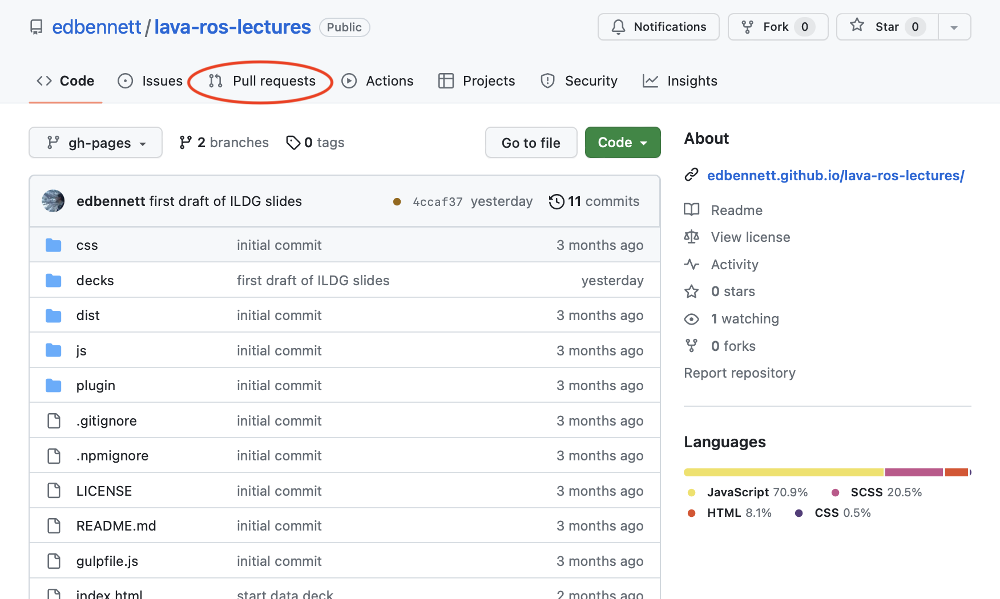

 <!-- .element height="400px" -->

Script:
Lattice quantum field theory is built almost entirely on computation. If you are going to do research in this field, then at some point you will need to write or contribute to the development of software.

-

 <!-- .element height="350px" style="vertical-align: middle; margin: 100px" --> +  <!-- .element class="fragment" height="200px" style="vertical-align: middle; margin: 100px;" -->

Script:
Even if you use one of the excellent community-developed codes to generate field configurations and computer observables on them, or use exclusively open data generated by other groups, you will want to write software to perform the analysis of your data. (Something to note here is that we are using the broadest definition of "software"&mdash;if you write a single line of code, you have written software!) We talk more in the reproducibility strand of this topic about why this is essential, but for the sake of this lecture we will take it as given that you _will_ automate your data analysis, and will need to write software for this.

-

user@desktop:analysis_code $ ls 
analysis.py 
analysis_su2.py 
analysis_kate.py 
analysis_alt_vacuum_subtraction.py 
analysis_2023paper.py 
analysis_aoki.py

Script:
Once you start working on more than one project, or have multiple subprojects within one project, or exchanging code with collaborators, tehn you will likely need to track multiple versions of your code. To start off with, you might make a separate copy of it to edit. [click] However, as you get more collaborators [click] and work on more projects [click], this starts to balloon [click]. At some point you'll have changes in one version of the file that you want to have in another, and you then have to start copying chunks of code around. This way of working makes it very likely that bugs will creep into your software, not to mention being very frustrating to need to manage.

-

 <!-- .element height="300px" -->

 <!-- .element height="100px" style="margin: 50px" -->  <!-- .element height="100px" style="margin: 50px" -->  <!-- .element height="100px" class="fragment" style="margin: 50px" -->  <!-- .element height="100px" class="fragment" style="margin: 50px" -->

Script:
A first step to overcoming this problem is to make use of a version control tool. This lets you maintain a consistent history of versions of a project; even as it develops diverging branches, the tool will have ways to help you manage and reconcile them. The most popular version control tool in use today is called Git; it was written by Linus Torvalds to manage the development of the Linux kernel, so it is more than capable of handling even the largest projects. [click] Git works best with text files, but this isn't limited to software source code&mdash;you can also use it for LaTeX projects such as paper drafts. If you've used Overleaf for LaTeX, this is built on top of Git, and if you're a subscriber it gives you the option to interface with it via Git rather than always needing to use the web interface. Another advantage that Git provides is letting us synchronise our work with collaborators working on the same project, both privately and openly. There's not space in this video to include a complete introduction to Git, but there are many good materials available online, which are linked in the video notes.

-

[  <!-- .element height="250px" style="margin: 100px" -->](https://github.com) [ <!-- .element height="250px" style="margin: 100px" -->](https://gitlab.com)

<!-- GitHub logo is CC-BY GitHub, Inc. GitLab logo is MIT-licensed by GitLab B.V. -->

Script:
Git's popularity has led an ecosystem of tools designed to interact with it to develop around it. Some of the most popular tools, potentially even more widely used than Git itself, are tools to manage development of your software and make it available to the world. The biggest of these are GitHub and GitLab, but all work in similar ways: you can create repositories that sit on GitHub or GitLab's servers, and you can push to and pull from them using `git` on your computer. You can make the repositories private to you or your collaborators, or you can make them open to the world. A lot of software is made available exclusively via GitHub or its competitors, so let's talk in more detail about some of the common workflows and etiquette to use GitHub effectively.

-

<!-- .element data-transition="slide-in fade-out" -->

 <!-- .element height="600px" -->

Script:
The source code for these slides is all available on GitHub, so let's use that as an example.

-

<!-- .element data-transition="fade-in fade-out" -->

 <!-- .element height="600px" -->

Script:
If you're working with a piece of software that someone has published on GitHub or a similar service, and you encounter a bug or other problem that you know isn't your fault, then you can let the author know by opening an Issue. When you do this, you should provide as much information as you can, to let the maintainer of the software be able to understand the problem, reproduce it, and identify the root cause of it, without which they will not be able to fix your issue. Be patient with the maintainer, as monitoring GitHub and fixing bugs not directly affecting them is not likely to be their primary job. You can also open issues on your own repositories; this is helpful to keep a "to-do" list of things you know could be improved or need to be fixed, but you can't get to right away.

-

<!-- .element data-transition="fade-in fade-out" -->

 <!-- .element height="600px" -->

Script:
Unless you're explicitly invited, you can't push to other people's repositories. If you want to extend or build on top of someone else's software project, you can create a Fork. This makes a copy of the repository in your own namespace that you can push or pull to.

-

<!-- .element data-transition="fade-in slide-out" -->

 <!-- .element height="600px" -->

Script:
If you are able to fix an issue that exists on someone else's repository, or implement an enhancement that others may find useful, then you can feed the changes back from your fork to the maintainer to consider merging into their version so that others can benefit from it. On GitHub, this is called a Pull Request; other platforms have their own names&mdash;for example on GitLab it's a Merge Request. In general it's considered polite to open an issue before preparing a pull request, to allow discussion of possible solutions and avoid wasting time if the problem is already being worked on by others.

-

 <!-- .element height="150px" style="margin: 75px" -->  <!-- .element height="150px" style="margin: 75px" -->  <!-- .element height="150px" style="margin: 75px" -->

<!-- GNU logo is CC BY-SA 2.0 Aurelio A Heckert -->

<a href="https://choosealicense.com">choosealicense.com</a>

Script:
As we discussed in the sections on open publication and open data, unless you give permission using a license, nobody has permission to make use of any software you share. Because software has some very specific considerations that aren't applicable to most creative work, it's not recommended for software to use the same Creative Commons licenses that we recommend for software and data. (But the same advice to not try and write your license applies here too.) Instead, there are specific pre-written software licenses that you can choose from. All require credit be given to the original authors. The main choice for you is whether you want those making use of your code to be required to share their modifications, or if they should be able to build it into other products that they can then keep proprietary. [click] To get help with a license, you can visit the website ChooseALicense.com, which is run by GitHub. Once you've chosen one, it is conventional to put a copy in the root of your repository in a file called `LICENSE`. The license may also give instructions around putting a message in each source file also.

-

[ <!-- .element height="150px" -->](https://citation-file-format.github.io)

 <!-- .element height="400px" -->

Script:
More specific to academia is the idea that if someone makes use of your software in their research, then they should cite you so that you and your funders are aware of the impact that your work is having. The Citation File Format gives a way of doing this; similarly to a license, you place a specifically-formatted file into the root of your repository, conventionally called `CITATION.cff`. Others using your code can find out from this how they should cite your work, and tools designed to work with CFF can generate the citations automatically. The Citation File Format homepage has more information on the specifics of the format, including tools to help generate and check the correctness of CFF files.

-

 <!-- .element height="200px" style="margin: 100px" -->  <!-- .element height="200px" style="margin: 100px" -->  <!-- .element height="200px" style="margin: 100px" -->

Script:
These few mechanisms form the basis of most open software development: by developing software in the open you enable others to benefit from your software, and you can also benefit from others' modifications to your work. Making use of issues helps everyone understand what limitations there are and how they can be overcome, forks enable others to take up development should the original author stop maintaining their version, and pull requests enable improvements to be contributed by anyone, not just the core development team. Licensing ensures that others are able to benefit from your work, and citation files ensure that you get appropriate recognition for it.

-

 <!-- .element height="200px" -->

Script:
There are a few more practices in open software development that can really empower your own work and that can help reduce friction when working with others. The first of these is automated testing. Once you have software that is more than a handful of lines long, it becomes increasingly important to be able to verify that it is giving the right answers. Of course, we can always test by running our code and checking that it appears to be working correctly, but as the complexity of software increases, it becomes harder to verify every possible route through the code and interaction of different pieces of functionality. Automated tests (including unit tests, regression tests, and integration tests) help to overcome this: by defining programmatically what correct behaviour of specific pieces of functionality are, we can then rapidly ensure that changes to our code do what they are supposed to, without breaking other aspects of the software. When you make contributions to software that has automated tests, you should make sure to use them to check that you haven't broken any of them before making pull requests, and should ideally also add new tests for any new functionality you introduce.

-

 <!-- .element height="200px" style="margin:100px" --> [ <!-- .element height="200px" style="margin:100px" -->](https://pre-commit.com)

 <!-- .element height="75px" class="fragment" -->

Script:
Keeping a consistent style of code is also very valuable when working with other people (remembering that other people includes yourself in six months!). This can be tedious to do by hand, but fortunately most languages have tools to make this much easier, including linters that will highlight stylistic inconsistencies within your text editor, and even autoformatters that will fix them for you automatically. These are fantastic when you remember to use them; to make that easier, there are also tools that will automatically run when you commit to your repository. [click] For example, if you see a file called `.pre-commit-config.yaml`, then the project uses a framework called "Pre-commit" to define and manage hooks. You should install these hooks before you commit or pull request to the repository.

-

Script:
Both linting and testing can happen automatically when you push to GitHub or GitLab. This gives an extra check, in case you or other contributors don't have pre-commit hooks set up, or forgot to run the test suite.

-

 <!-- .element height="100px" style="vertical-align: middle; margin: 50px;" --> [  <!-- .element height="150px" style="vertical-align: middle; margin: 50px" -->](https://github.com) [ <!-- .element height="150px" style="vertical-align: middle; margin: 50px" -->](https://gitlab.com)  <!-- .element height="150px" style="vertical-align: middle; margin: 50px" --> [ <!-- .element height="100px" style="vertical-align: middle; margin: 50px" -->](https://citation-file-format.github.io)  <!-- .element height="100px" style="vertical-align: middle; margin: 50px" -->  <!-- .element height="100px" style="vertical-align: middle; margin: 50px" -->  <!-- .element height="100px" style="vertical-align: middle; margin: 50px" -->  <!-- .element height="100px" style="vertical-align: middle; margin: 50px" -->  <!-- .element height="100px" style="vertical-align: middle; margin:50px" --> [ <!-- .element height="100px" style="vertical-align: middle; margin: 50px" -->](https://pre-commit.com)

Script:
To summarise: most importantly, version control your code, most likely using Git. You can use GitHub, GitLab, or similar to host your code to be accessible from anywhere, and to collaborate with others. (This isn't a good venue to publish code for citation, however; we'll talk about that in a separate video.) When you work collaboratively and make code available, make sure to choose an appropriate software license, and provide a means of researchers using your code to cite you. Use Issues to keep track of pending tasks on your own projects, and to report problems to maintainers of other packages. To build on top of someone else's project, fork it; if your changes could be valuable to others, then feed them back with pull requests or similar mechanisms. Do make sure your code has automated tests, and run tests before committing and pull requesting. And do use auto-formatters and pre-commit hooks to maintain a consistent style and quality level in your code.
