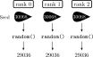
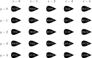

$$(a + b) + c \ne a + (b + c)$$

<span class="fragment" data-fragment-index="1">$\left[2^{64} + (-2^{64})\right] + 1 = $</span> &nbsp;<span class="fragment" data-fragment-index="2">$1.0$</span>

<span class="fragment" data-fragment-index="1">$2^{64} + \left[(-2^{64}) + 1\right] = $</span> &nbsp;<span class="fragment" data-fragment-index="3" style="color: red;">$0.0$</span>

Script:
In this video, we'll talk about some of the problems that parallelism brings to reproducibility of our lattice computations. We'll start with problems that happen even on a single CPU core, and work our way up to those that crop up in large multi-node computations. One problem that we'll hit at most of these levels is that of associativity. Normally, one would not expect the order of operations to matter when performing addition; however, for floating point numbers this no longer holds. For example [click] subtracting two large numbers and adding a small one [click] gives a different result [click] to adding the small number to a large one and then performing the subtraction.

-

$$a(b + c) \ne ab + ac$$

<span class="fragment" data-fragment-index="1">$10^{16}(1+10^{-16})-10^{16}(1-10^{-16}) = $</span> &nbsp;<span class="fragment" data-fragment-index="2">$2.0$</span>

<span class="fragment" data-fragment-index="1">$10^{16}\left[(1+10^{-16})-(1-10^{-16})\right] = $</span> &nbsp;<span class="fragment" data-fragment-index="3" style="color: red;">$1.11\ldots$</span>

Script:
Similarly, distributivity does not hold for floating-point numbers. [click] Subtracting two very close numbers and then multiplying by a large one [click] gives a different result to multiplying each pair of numbers before performing the subtraction [click].

-

    -ffast-math

    -Ofast


Script:
In compiled languages, optimisations that have the potential to cause non-reproducible behaviour (for example, because they assume associativity or distributivity) are typically disabled by default, and must be explicitly enabled using an optimisation option like `-ffast-math` or `-Ofast`. This means that if you are looking for bitwise reproducible results, you have to disable this feature (and give up the speed boost it would give). However, if it is sufficient for your results to be reproducible within errors, then you can enable this. (If your implementation gives _significantly_ different results in these cases, then there is something wrong with the algorithm or implementation that you should fix!)

-

$$a \leftarrow b\cdot c + d$$

Script:
One example of an instruction that is gated behind the `-ffast-math` flag is the "fused multiply add" operation, present on most modern CPUs and GPUs, which combines a multiplication and an addition into a single operation. This is quicker than performing the two operation separately, but because of rounding and associativity, can give a different answer. On modern CPUs and GPUs, a significant amount of performance relies on some of these behaviours, so for performance you will want to enable them; just be aware that your results may not be bitwise reproducible on other machines, and as mentioned, verify that your algorithms (and their implementations) are numerically stable.

-

```
double sum(double values[N]) {
    double total;
    for (int i = 0; i < N; i++) {
        total += values[i];
    }
}
```

Script:
Once you start using multiple processing cores, either on a CPU or a GPU, a loop like the one on the screen will be divided between them. When this is done, there will usually be no way to know which iterations happen first, since different cores may run slightly faster, or have slightly less load. Since floating-point numbers are not distributive, this can give different values on different hardware (or even on the same hardware at different times), which will again mean you lose bitwise reproducibility.

-

<div class="r-stack">

 <!-- .element width="850px" class="fragment current-visible" -->

 <!-- .element width="850px" class="fragment current-visible" -->

 <!-- .element width="850px" class="fragment current-visible" -->

</div>

Script:
When running with MPI or similar models where multiple separate programs are running and passing data between each other, then you need to make sure that things that should be synchronised between different ranks are, and things that shouldn't be are not. Since our focus here is on reproducibility we won't go into full details of how to approach parallel programming, but since we've discussed the need to seed random number generators, we do need to talk about how to do this in parallel. Something that won't work is having a separate RNG on each rank, each using the same seed&mdash;this will mean that each subdomain of your lattice gets exactly the same sequence of random numbers, which will mess up your statistics. [click] One way to work around this would be to seed one RNG per parallel task. However, this means that re-running the computation with a different parallelisation would give different results. [click] A more reproducible approach is to create a separate random number generator for each site on your lattice, and seed it separately. (As discussed elsewhere, these seeds also need to be reproducible, but randomly distributed, to avoid introducing correlations.)

-

<div class="r-stack">

 <!-- .element class="fragment current-visible" -->

 <!-- .element class="fragment current-visible" -->

</div>

Script:
Another class of parallel bug that can create issues for reproducibility is the _race condition_. This is where the output depends on the ordering of things happening in parallel whose ordering you don't control. For example, if you have an element of your workflow that outputs "figure1.pdf", and you call that element three times with different parameters, how do you know which result will end up in the plot? Race conditions are a very common bug in parallel programming, and exploring all ways to avoid them is outside the scope of this course, but at the minimum, [click] you can verify that where workflow elements are designed to be called multiple times, their output filename depends on their input parameters.

-

<div class="fragment">

$$(a + b) + c \ne a + (b + c)$$

</div>

 <!-- .element height="300px" class="fragment" style="margin: 50px;""" -->  <!-- .element class="fragment" height="300px" style="margin: 50px;" -->


Script:
To recap: [click] Be aware that parallelism (on CPU and GPU) and other speed-enhancing optimisations can break bitwise reproducibility for floating-point numbers. [click] Make sure to take good care of your random numbers when running in parallel. [click] And watch out for race conditions, particularly when outputting files from workflows.
