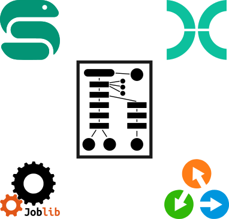
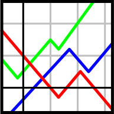
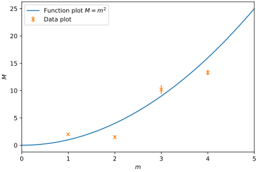
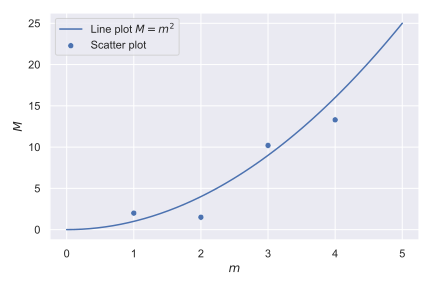
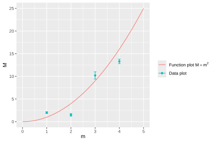
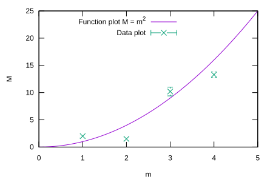
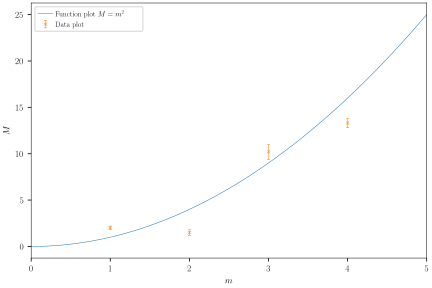
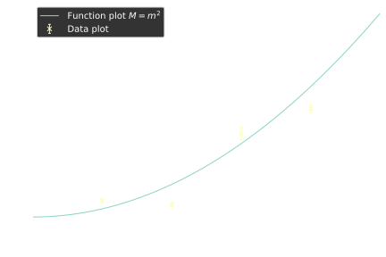
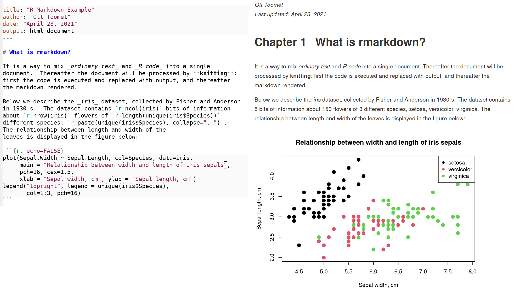
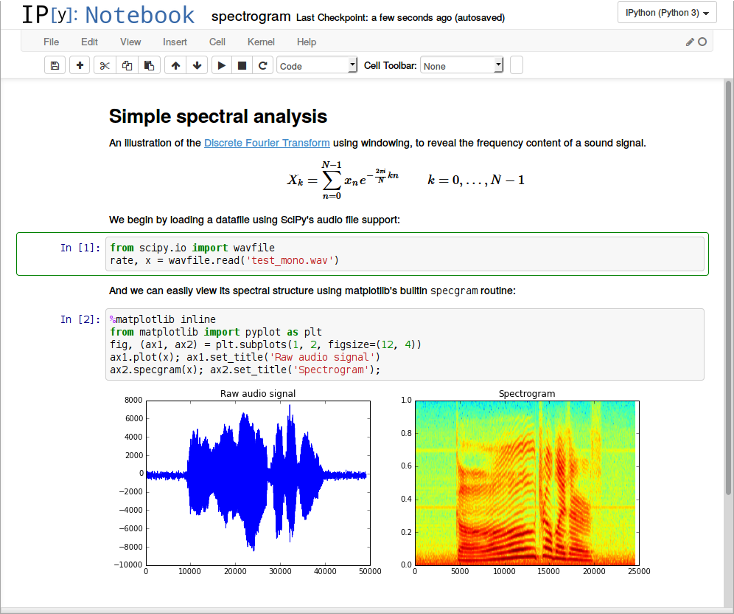

<div class="r-stack">

 <!-- .element class="fragment current-visible" height="400px" -->

 <!-- .element class="fragment current-visible" height="400px" -->

 <!-- .element class="fragment current-visible" height="400px" -->

 <!-- .element class="fragment current-visible" height="400px" -->

</div>

Script:
We've discussed elsewhere
that the biggest enabler of reproducibility of our results
is to automate as many steps as possible.
The same is true of our data presentation:
if each time we update our underlying data we need to
[click]
manually tweak a dozen plots,
[click]
and transcribe a hundred numbers into tables,
then we are guaranteed to introduce mistakes,
either by doing a step incorrectly,
or by forgetting to update one or more elements.
We'd instead like to have a solution
[click]
where we can run a single command,
[click]
and have up to date versions of
all results that are included in our publication.

-

 <!-- .element height="500px" -->

Script:
In the video on reproducible data analysis,
we discussed the benefits of using a workflow manager
to co-ordinate the various tasks that need to be performed
when performing data analysis;
the same applies to data presentation.
If you skipped the video on data analysis,
then go back and catch up on that before continuing.

-

<table>
<tr>
<td colspan="2" style="text-align: center; padding-left: 55px; padding-right: 55px;"><a href="https://python.org"></a></td>
<td style="padding-left: 55px; padding-right: 55px; text-align: center; "><a href="https://r-project.org"></a></td>
<td rowspan="2" style="vertical-align: middle; padding-left: 55px; padding-right: 55px; text-align: center;"><a href="https://gnuplot.info"></a></td>
</tr>

<tr>
<td style="text-align: center; padding-left: 22px; padding-right: 22px"><a href="https://matplotlib.org/"></a></td>
<td style="text-align: center; padding-left: 22px; padding-right: 22px"><a href="http://seaborn.pydata.org"></a></td>
<td style="text-align: center; padding-left: 22px; padding-right: 22px"><a href="https://ggplot2.tidyverse.org"></a></td>
</tr>

<tr>
<td></td>
<td></td>
<td></td>
<td></td>

</tr>
</table>

Script:
The most common data presentation step is generating plots.
Most languages offer libraries to automate this process;
for example,
[click]
in Python,
[click] Matplotlib and
[click] Seaborn are the most commonly used,
while
in [click] R,
[click] ggplot2 is popular.
There are also standalone, scriptable tools
designed specifically for plotting;
[click] gnuplot is a commonly-used example of these.
It largely doesn't matter which plotting tool you use,
provided it can generate the plots that you need,
and is able to be automated.
You can see here what the default plot style is for each of these,
but each is very customisable,
and likely to be able to get close to any style you may want.
Graphical plotting tools,
while they can be quick for prototyping
and allow you to make custom tweaks to the output,
lock you into repeating these steps manually
every time you want to regenerate your plot.
This isn't good for reproducibility,
or an efficient use of your time.

-

<div style="float: left; width: 700px">

```python
$ head plot_script.py
import matplotlib.pyplot as plt

plt.rcParams["figure.figsize"] = (7, 4)
plt.rcParams["font.size"] = 16
plt.rcParams["axes.labelsize"] = 16
plt.rcParams["legend.fontsize"] = 16
plt.rcParams["lines.markersize"] = 2.0
plt.rcParams["lines.linewidth"] = 0.8
plt.rcParams["lines.markeredgewidth"] = 0.8
plt.rcParams["font.family"] = "lmodern"
plt.rcParams["text.usetex"] = True
plt.rcParams["errorbar.capsize"] = 2
```

</div>

<div style="float: right; width: 500px;" class="fragment">

```python
$ head paper.mplstyle
figure.figsize: 7, 4
font.size: 16
axes.labelsize: 16
legend.fontsize: 16
lines.markersize: 2.0
lines.linewidth: 0.8
lines.markeredgewidth: 0.8
font.family: lmodern
text.usetex: True
errorbar.capsize: 2

$ head plot_script.py
import matplotlib.pyplot as plt
plt.style.use("./paper.mplstyle")
```

</div>

Script:
Speaking of how your plots look,
you probably want your plots to look consistent with each other.
One way to do this is to write a long list of commands
to set up the appearance exactly how you want it for one plot,
and then copy and paste that block of code
into every plotting script you use.
However,
most plotting libraries let you define a style file
[click]
to contain the standard rules you want to apply to all of your plots,
that you can load at the start of your plotting script.
Then the only changes you need to make in code
are any adjustments specific to one individual plot.

-

<!-- .element data-transition="slide-in fade-out" -->

 <!-- .element height="400px" -->

Script:
A benefit of using a style file is that if necessary,
you can swap it for another one.
For example,
if you have prepared a set of plots for a journal,
with a light background and serif font like this,

-

<!-- .element data-transition="fade-in slide-out" data-background-color="black" -->

 <!-- .element height="400px" -->

Script:
and you need to switch it for a dark background and different font
for a conference talk,
this can be done by changing one parameter,
rather than needing to reconfigure many plots one-by-one.

-

<div>

<pre>
Ensemble M1:
mass: 3.1415 ± 0.0926
decay constant: 5.35897 ± 0.00932
Ensemble M2:
mass: 3.84626 ± 0.04338
decay constant: 3.27950 ± 0.00288
Ensemble M3:
mass: 4.1971 ± 0.6939
decay constant: 9.3751 ± 0.0582
Ensemble M4:
mass: 0.97494 ± 0.04592
decay constant: 3.078 ± 0.164
</pre>

</div>

$\downarrow$

<div>

<table>
<tr><th>Ensemble</th><th>$m$</th><th>$f$</th></tr>
<tr><td>M1</td><td><span class="fragment">0.3142(93)</span></td><td><span class="fragment">5.3590(93)</span></td></tr>
<tr><td>M2</td><td><span class="fragment">3.846(43)</span></td><td><span class="fragment">3.2795(29)</span></td></tr>
<tr><td>M3</td><td><span class="fragment">4.20(69)</span></td><td><span class="fragment">9.375(58)</span></td></tr>
<tr><td>M4</td><td><span class="fragment">0.975(46)</span></td><td><span class="fragment">3.08(16)</span></td></tr>
</table>

</div>

Script:
While they're the most obvious,
plots aren't the only things that benefit from automation.
You might have previously generated tables in LaTeX
by transcribing numbers by hand,
or copying and pasting CSV into web-based LaTeX table generators.
These are manual steps that can introduce errors&mdash;would
you have noticed if one of the numbers on screen was a digit out?
And similarly to tweaking plots,
they're easy to forget about,
so papers can end up with different tables
reflecting inconsistent underlying data.

-

```python
df.to_latex("tables/table1.tex")
```

$\downarrow$

```tex
\begin{table}
    \caption{A spectrum.}
    \input{tables/table1.tex}
\end{table}
```

Script:
Instead,
think about getting your code to generate the LaTeX tables directly
as a `.tex` file.
You can incorporate them into your publications
without the need for copy and paste
by using `\input`.

-

<div class="r-stack" style="float: left;">

 <!-- .element class="fragment fade-out" data-fragment-index="3" width="450px" -->

 <!-- .element class="fragment current-visible" data-fragment-index="3" width="450px" -->

</div>

<div style="float: right;">

<div class="r-stack" style="width: 600px;">

```tex
\newcommand \gmuResultFinal 0.0314(15)
```
<!-- .element class="fragment current-visible" data-fragment-index="2" -->

```tex
\newcommand \gmuResultFinal 0.0271(82)
```
<!-- .element class="fragment current-visible" data-fragment-index="3" -->

</div>

$\downarrow$ <!-- .element class="fragment" data-fragment-index="2" -->

```tex
\input{definitions.tex}

\begin{document}
We find that $g_\mu = \gmuResultFinal$.
```
<!-- .element class="fragment" data-fragment-index="2" -->


Script:
We can take this a step further.
Frequently we want to quote numbers in the text of our documents.
Since these numbers will usually be the result of our analysis workflow,
we'd prefer if they could be generated automatically.
In particular,
if you quote many numbers in the text,
or quote one number in many places,
it can be challenging to keep them all consistent by hand
as the analysis is updated.
Similarly to tables,
we output a `.tex` file,
[click]
but in this case we use `\newcommand` to define a macro
that we can use wherever we want to quote a particular number.
When the workflow is re-run,
[click]
updating the `.tex` file will update the numbers everywhere they are used.

-

```shellsession
$ cp ensemble1/effective_mass_g5.pdf ../paper/effective_mass_g5_ensemble1.pdf
$ cp ensemble2/effective_mass_gk.pdf ../paper/effective_mass_gk_ensemble2.pdf
$ cp code/analysis/spectrum_summary.pdf ../paper/
$ cp code/analysis/spectrum_summary.tex ../paper/
$ cp code/analysis/metafit.pdf ../paper/
$ cp code/analysis/spectrum_definitions.tex ../paper/
...
```

Script:
Now,
we've taken steps to generate all of our results automatically,
but there are still some things we're having to do manually&mdash;namely,
keeping all of the TeX and image files we're generating in sync.
If each file is manually copied in when it is changed,
then it is all too easy for some to be forgotten,
meaning that our paper is in an inconsistent state,
where different figures reflect different underlying data.

-

```
$ tree assets
assets
├── definitions
│   └── spectrum.tex
├── plots
│   ├── effective_mass_g5_ensemble1.pdf
│   ├── effective_mass_gk_ensemble2.pdf
│   └── spectrum_summary.pdf
└── tables
    └── spectrum_summary.tex

4 directories, 5 files
```

```tex
\includegraphics{assets/plots/spectrum_summary.pdf}
```

Script:
To avoid this,
it can be a good idea to generate all outputs to be included in a publication
in a single `assets` directory.
This can then be deleted from your LaTeX project and replaced afresh
each time you run your workflow.
When you're ready to publish,
you can also delete the `assets` directory generated by the workflow
and regenerate it completely from scratch,
to make sure that no leftover files from previous runs are present.

-

```python
rule collate_spectra:
    input:
        "{ensemble}/effective_mass_{channel}.pdf",
    output:
        "assets/plots/effective_mass_{channel}_{ensemble}.pdf",
    shell:
        "cp {input} {output}"
```

Script:
As a quick aside,
you don't have to re-work all of your analysis scripts
to put intermediary plots into your assets directory.
Instead,
you can add an extra rule to your workflow manager
to tell it how to collate plots,
and then specify which plots
you want to end up in the assets directory.

-



Script:
While we're talking about presentation,
it's worth noting a couple of technologies
that allow you to mix code,
presentation,
and discussion in a single document.
One of these is [RMarkdown](https://rmarkdown.rstudio.com).
This lets you mix code
(not just R)
with write-up in Markdown syntax.
You can then “knit” the file together,
which will result in a PDF, HTML, or similar document
that shows the output of the code and the formatted discussion.
This guarantees that the output of every code block will be in sync.
Currently no journals in lattice accept this kind of submission,
however,
so it has limited utility.

-



Script:
Jupyter Noteboks are very popular,
and were initially developed out of the IPython ecosystem
spearheaded by Fernando Pérez,
during his PhD research in lattice field theory.
Similarly to RMarkdown,
Jupyter Notebooks allow you to mix code and data,
and save the output.
However,
they can be executed out-of-order;
this makes them very convenient for rapid exploration of data
and prototyping of code,
but makes the results harder to reproduce.
There are ways that Jupyter Notebooks can be tamed
to make them more reproducible,
which we don't have time to go into in this video,
but where a choice is available
then using other tools can make life easier.

-

 <!-- .element height="200px" class="margin50" -->
 <!-- .element height="200px" class="margin50" -->
 <!-- .element height="200px" class="margin50" -->

 <!-- .element height="200px" class="margin50" -->
 <!-- .element height="200px" class="margin50" -->

Script:
To recap:
we really want to use a workflow manager to co-ordinate generating our outputs.
We want to automatically generate plots of our data,
and format them consistently using style files.
We want to generate the LaTeX source of our tables automatically.
And we want to define LaTeX macros for any numbers
we will quote in the text of our papers.
All of these
we want to put into a single `assets` directory,
that we can copy into our LaTeX project once our workflow generates it,
deleting the old version each time.
