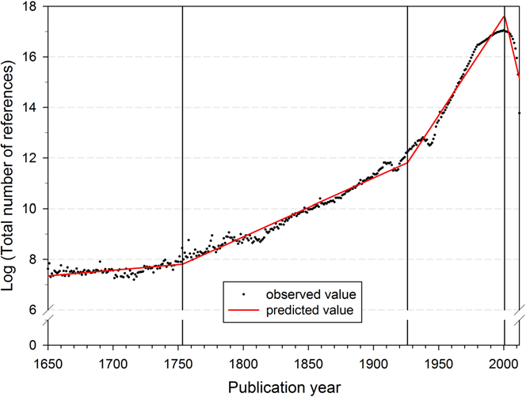
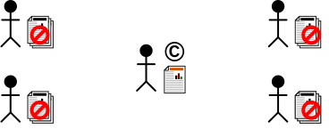
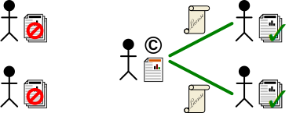
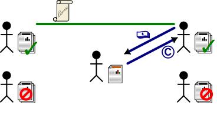
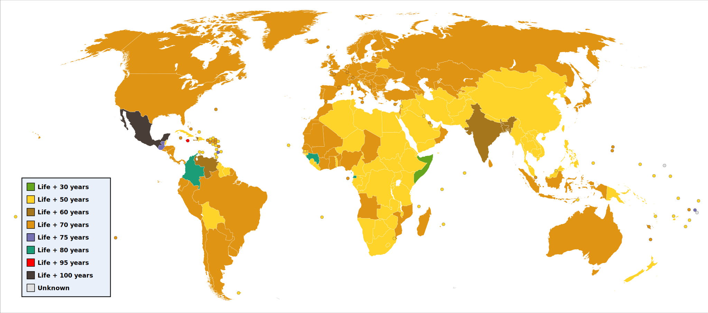
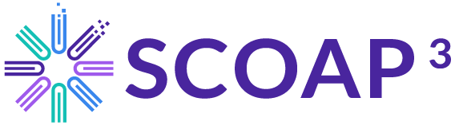
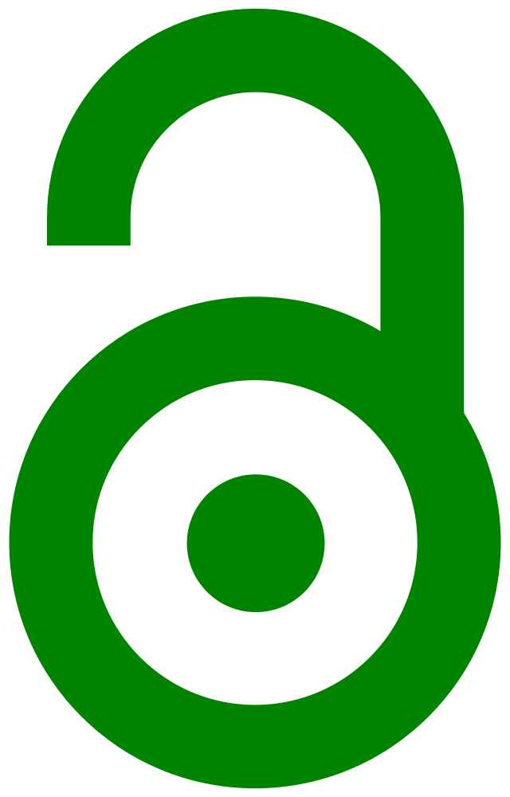

 <!-- .element: width="800px" -->

[Bornmann and  Mutz, 2015, 10.1002/asi.23329](https://doi.org/10.1002/asi.23329)

Script:
In the first video of this section, we discussed how there has been an explosion in the number of publications, the number of journals publishing them, and the costs of gaining access to them. If you haven't had the chance to watch that yet, then it'd be a good idea to go back and review that before carrying on here.

-

  
  
  

Script:
In the early 2000s, this situation started to become unmaintainable, and alternative models started to emerge. Two such approaches have become codified as the "standard" routes to open access as of 2023. Gold open access is where you publish your work in a journal that makes the article available as open access. Green open access on the other hand is where you make a version of the manuscript available via an archiving service, regardless of whether the version in the journal is locked behind a subscription.

-

©

Script:
Before we can talk more meaningfully about these two models of open access, we need to understand a little bit about copyright.

-

<!-- .element data-transition="slide-in fade-out" -->

Script:
Put briefly, first introduced in Great Britain over 300 years ago, copyright gives you as the creator of a piece of work the exclusive right to make copies of it.

-

<!-- .element data-transition="fade-in fade-out" -->

Script:
You can then choose to give others permission to make copies, imposing whatever terms you like&mdash;for example, payment of a royalty for each copy, or limiting copying for non-commercial use. In the illustration, the two people on the right have been given licenses to copy, so are allowed, while everyone else still isn't.

-

<!-- .element data-transition="fade-in slide-out" -->

Script:
You can also sell or otherwise transfer the copyright to someone else; they then have all the rights, and you have none, unless you agreed to retain some. In the illustration, the person at the top right has bought the copyright, and then given the person at top a license to make copies; the others have no right to.

-

[CC BY 3.0 Balfour Smith, Badseed](https://commons.wikimedia.org/wiki/File:World_copyright_terms.svg)

Script:
The length of time copyright lasts for varies based on many factors, but in most places for most works it is some length of time past the death of the original author.

-

[ <!-- .element width="800px" -->](https://creativecommons.org)

Script:
I mentioned earlier that nobody has any rights to make copies of your work unless you give them permission. One way you can do this is to pick a standardised copyright license, where you make your work available to anyone willing to follow certain conditions. The Creative Commons defines a number of such licenses; for example, you can choose to share on permission that you are acknowledged as the author, or provided that the person making copies also makes any modifications they make available under the same terms. If you see a series of letters starting with "CC", this frequently refers to a Creative Commons license. For more information, see the Creative Commons website.

-

<table>
<tr>
<td>Open access journal</td>
<td>Hybrid journal</td>
<td>Closed journal</td>
</tr>
<tr>
<td style="text-align: center;"></td>
<td style="text-align: center;"> ©</td>
<td style="text-align: center;">©</td>
</tr>
</table>

Script:
So what does gold open access look like? We submit an article to an open-access journal (or a hybrid journal, which has both open-access and subscription-only articles). Since the journal will not be paid by subscription fees for an open-access article, there is likely an Article Processing Charge to be paid, to cover the journal's costs both in formatting the article and also in making it available for the future. After the review process completes, then the article is made available, most frequently under the Creative Commons Attribution license, which you may see written as CC BY. This means anyone can make a copy of it, provided they acknowledge you as the author and link back to the original.

-

[ <!-- .element width="800px" -->](https://scoap3.org/)

Script:
While there is usually an article processing charge to be paid, in some cases this is covered by a broader agreement, rather than you needing to pay out of your own pocket. In particle physics the SCOAP3 agreement pays for the majority of research articles to be gold open access automatically, including in journals like JHEP and Physical Review D. For a full list of journals, see the SCOAP3 website.

-

 <!-- .element width="400px" -->

Script:
What about green open access? If you publish without gold open access, then the journal will usually require you to transfer the copyright to them. This may restrict what you can do&mdash;for instance, they may impose an embargo period, or forbid you from sharing the version of the manuscript post-peer review. In response to this, funders have introduced a policy of "rights retention", where you inform the journal at time of submission that the submission is conditional on being able to make the reviewed manuscript open access without embargo. This allows you to upload to the arXiv, as well as any other institutional repositories you might need to upload to, with a Creative Commons license.

-

## Key points

* Use SCOAP3 for gold open access where possible
* Where gold open access is not available, use a rights retention statement
* Publish preprints and accepted manuscripts on arXiv
* Refer to institutional and funder guidance

Script:
To sum up the key things you need to do when publishing your work. Next, if you're publishing work that is in the scope of SCOAP3, it makes life easier if you target a journal that it covers. For work not covered by SCOAP3, or where other factors mean you need to use a journal not covered by it (and you don't have funding to pay an Article Processing Charge), then add a rights retention statement to your manuscript and to the covering letter to the journal, so that you will retain the right to make the accepted manuscript available as open access. Once your manuscript is accepted, then make the accepted version available on the arXiv; if you published a preprint then do this as a replacement rather than a separate submission. (The main circumstance where you definitely shouldn't make a preprint available is if you are submitting to one of the few high-profile journals that does not allow it, like Nature.) If your article is gold open access, you can also make the final Version of Record available on the arXiv, as well as or instead of the accepted manuscript. Finally, do check your own institution's and your funders' policies around open access and rights retention&mdash;they may be more prescriptive than the general guidelines here.
