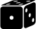
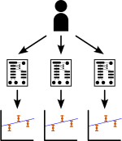
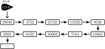

 <!-- .element class="fragment" style="vertical-align: center; margin: 100px;" -->  <!-- .element class="fragment" style="vertical-align: -150px; margin: 100px;" height="400px" --> 

Script:
As has been discussed elsewhere, lattice field theory depends heavily on Monte Carlo methods, which rely on using [click] random numbers, which as a general rule cannot be predicted. But we want our results to be [click] reproducible, giving the same result every time. If the random numbers we use change each time, then this won't be the case. This also applies in measurements, where we might want to use stochastic sources, and in data analysis with techniques like bootstrapping.

-

 <!-- .element height="300px" -->

 <!-- .element height="300px" class="fragment" -->

Script:
Something that works in our favour is that computers aren't actually particularly good at producing truly random numbers. Most of the time they will instead produce _pseudo_-random numbers, that statistically appear to be random, but are in fact generated deterministically. [click] Given a particular starting state, you will always reproduce the same sequence.

-

[image incoming]

Script:
So if we pick our favourite seed, say 12345, and always use that, then everything will be OK, right? Unfortunately not! If you use the same random sequence for every point in your ensemble, then you will introduce spurious correlations between data points that should be independent of each other. The blue and orange data in the graph shown each used a common seed, and appear far better correlated than the green data where each point used a different seed; this correlation may make the data coming out of your work appear more reliable than it is, or even lead you to false conclusions. Even seeds chosen in sequence can introduce slight correlations, although the effects are harder to observe. We'll talk more about choosing seeds in a few slides.

-

[image tbc]

Script:
In general, you won't generate a complete ensemble of configurations in a single go. Because generation takes a long time, and supercomputers generally impose limits on the time you can run for at once, your generation will be split into sequential jobs. So what do we do about random numbers at the start of each job? Can we re-use the same seed for each one? Unfortunately not&mdash;if we do that, then we will introduce spurious autocorrelations visible in the data. Instead, we should persist the state of the random number generator along with the field configuration at the end of a job, and resume from that state. This means that we only have a single seed for a run, and so it can be reproduced without needing to use the same size of job.
