Same data $+$ same analysis $\rightarrow$ Same results

Script:
Work in lattice field theory has a number of phases, including configuration generation, measurement, and subsequent data analysis. Each of these has its own specific concerns when it comes to how to make the computation reproducible. In this video we will focus on the aspects of reproducibility that are common to all of these; aspects specific to a particular type of computation will be in a separate video. Let's start by recapping the definition of "reproducibility" that we are using. A piece of work is reprodcuible if given the same input data, and applying the same computational techniques to them, then we get the same results out at the end. But this alone isn't a precise definition&mdash;[click] in particular, we need to define what we mean when we say that results are "the same".

-

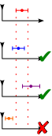 <!-- .element height="600px" style="margin:100px" --> 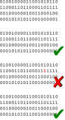 <!-- .element height="600px" "style="margin:100px" -->

Script:
There are two main types of reproducbility in this context. One form is that you can obtain results that are compatible within errors with the original&mdash;if your methods don't allow that, then there is a significant concern over whether you are producing valid science. The second is that you can obtain every single number identically down to the last bit, known as "bitwise reproducibility". This is generally the ideal target, but we'll discuss some cases where that may be particularly hard, or lead to significant wasting of computational resources.

-

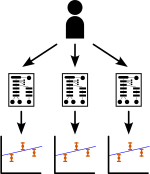 <!-- .element height="400px" style="margin:100px" --> 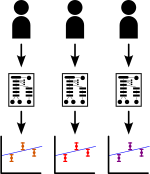 <!-- .element height="400px" style="margin:100px" -->

Script:
There is also a distinction to be made between ensuring that successive runs of the same software by you as the author give the same results (which, again, is the minimum you would want to consider a result publishable) and ensuring that others are able to re-run your analysis and obtain the same results. In this context it's important to remember that the set of "other people" includes "you in six months' time (or less)"&mdash;work you do now to ensure reproducibility is likely to be very helpful when you need to revisit an analysis tool or technique later.

-

<!-- .element data-transition="slide-in fade-out" -->

![Illustration of some sample text, including the highlighted sentence "These results were generated using AwesomeLat, available from Ref. [42]."](./images/name-software.svg)

Script:
The first step towards helping others to be able to understand and reproduce your work is to name the software that you have used. Naming only the algorithms used isn't enough here&mdash;it's likely many pieces of software exist that implement that algorithm, and each may do so slightly differently. For example, different conventions on normalisations of certain parameters can very quickly mean that you will not get the same output given the same input. Of course, if you've written your own software, then you will need to share it openly for this specification to be meaningful to others, but even if your code is not open, knowing that it is not a different implementation will prevent others from chasing down rabbit holes if their results don't reproduce yours.

-

<!-- .element data-transition="fade-in fade-out" -->

![The same illustration as the previous slide, but with the text of Ref. [42] shown to be "A. N. Author, AwesomeLat Contributors. AwesomeLat commit f191eaf, available https://github.com/-an--author-/AwesomeLat. DOI: 10.5281/zenodo.1234567."](./images/name-software-with-reference.svg)

Script:
While it's a vital first step, naming the software isn't usually sufficient to guarantee reproducibility. The same software may change its behaviour between versions, either removing bugs or changing default algorithms and parameters. We need to specify the version of the software that we have used to generate a particular result. For prepackaged software, a version number might be sufficient here. For actively-developed software held in version control (which will include most lattice codes), then the commit identifier from the version control system is a better choice. If someone else needs to reproduce your result, they should be able to clone the repository and check out the correct commit. If you or the software authors can create a Zenodo release for the version you're using, then this is even better, since GitHub and similar platforms don't guarantee to keep links working for the long term. To find out more about Zenodo, take a look at the video on Open Software Development.

-

<!-- .element data-transition="fade-in slide-out" -->

![A similar illustration, but with the text "These results were generated using AwesomeLat [42], with modifications to enable support for hypergeometric fermions, available from Ref. [43]." and references "[42] A. N. Author, AwesomeLat Contributors. AwesomeLat, available https://github.com/-an--author-/AwesomeLat.
[43] I.T. ’S. Me, A. N. Author, AwesomeLat Contributors. AwesomeLat commit be3f57e, available https://github.com/-its--me-/AwesomeLat. DOI: 10.5281/zenodo.1234568."](./images/name-software-with-modifications.svg)

Script:
Quite often you may find yourself modifying a piece of publicly-available software to perform a piece of work. In this case, it isn't sufficient to state that you used "a modified version" of some named piece of software, because then nobody will know what those modifications look like, or how extensive they are. If the changes you have made are likely to be of interest to the wider community, then you should consider contributing the changes back to the original authors; for more details about this, see the video on Open Software Development. Otherwise, you should aim to provide a way for the reader to access your fork of the software, as well as giving attribution back to the original authors.

-

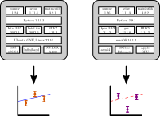

Script:
Unfortunately, even this level of specification doesn't necessarily allow others to precisely reproduce your work. Your software behaves the way it does in part due to the hardware and software environment in which it runs; change any of this, and it can change its behaviour. While large workloads on supercomputers are likely to be stable (as they typically have few dependencies and vendors work hard to ensure consistency), analysis workloads can change a lot, as subtle changes between different versions of libraries can introduce changes in your results that are magnified significantly.

-

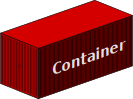

Script:
One way that has been developed to approach this problem is to release as much of the original environment as possible, using a technology called containerisation. By developing your software inside a container (or with containerisation in mind), you reduce the amount that your own system's idiosyncracies affect the software. Once your work is complete, you can then share the container, or the recipe used to build it, with others, who can run the exact environment that you ran&mdash;you solve the "works on my machine" problem by sharing your machine. This is not without downsides&mdash;container images can be very large, and you are forced to make a trade off between auditability of the code and environment (if you share the recipe) and the ability of anyone to re-run the software in the future (if you share the built container), since it's not guaranteed that your recipe will keep workin forever. An alternative to containerisation is careful specification of the exact runtime environment, to be included in your workflow or other releases. We won't go into the fine detail of how to specify your environment (with containers or otherwise) in this video, but more information is linked in the lesson notes.

-

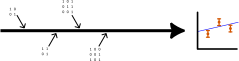

Script:
Many of the points we've discussed thus far are in fact aspects of a wider concept of _provenance_: the idea that you should be able to identify where things came from and how they were made. For example, your software should include metadata with its output identifying what the source data were, where they came from, and what processes were used to analyse them. We'll talk more about some specific types of provenance to track in subsequent videos.

-

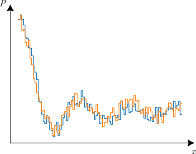

Script:
Since lattice is built on Monte Carlo methods, we make extensive use of random numbers. Even the downstream analysis may make use of randomness, for example, in bootstrap sampling. By definition, truly random numbers aren't reproducible; however, if our conclusions change (that is, our results change well outside of their error bars) based on which random numbers were chosen, then something has gone very wrong with our methodology. That said, it is far easier to assess our reproducibility if we can remove these sources of difference, as they may be masking other ways in which our results are subtly non-reproducible. Fortunately, true random numbers are hard for deterministic computers to come by, and so for most purposes we use pseudorandom numbers instead.

-

Script:
With a pseudorandom number generator, the sequence of random numbers obtained from a given starting point is always the same, so provided all other aspects of a computation using them are reproducible, then the output should be identical every time. Since this is not what most people want from randomness in their software, many programming languages will helpfully randomise their generator (using some source of entropy) rather than always giving the same output. It is therefore important to seed your random number generators&mdash;to set up the state in a consistent way at the start of an analysis. The choice of seed is arbitrary&mdash;again, if your results depend on the seed, something has gone wrong! While in principle the seed can be fixed to a number of your choice, this may raise questions as to whether this has been tuned to give a desired output; these questions can be avoided by instead deriving the seed from some property of the dataset being analysed.

-

 <!-- .element width="150px" style="margin: 25px; vertical-align: middle;" -->
  <!-- .element width="150px" style="margin: 25px; vertical-align: middle;" -->
 <!-- .element width="150px" style="margin: 25px; vertical-align: middle;" -->
 <!-- .element width="150px" style="margin: 25px; vertical-align: middle;" -->
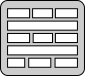 <!-- .element width="150px" style="margin: 25px; vertical-align: middle;" -->
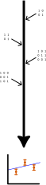 <!-- .element width="100px" style="margin: 25px; vertical-align: middle;" -->
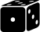 <!-- .element width="100px" style="margin: 25px; vertical-align: middle;" -->

Script:
To sum up, we want our research to be reproducible, both when we re-run the analysis and when others seek to verify it. Some aspects common to most lattice computations are that the reader needs to know what software was used, including specifying versions and any modifications made, and the environment in which that software was run. More generally, the reader should be able to understand the provenance of the data being presented&mdash;which data were used as input, which generated data made use of which input data, and what processes were performed (including when, and by whom). Finally, randomness is a vital aspect of most lattice computations; using a seeded random number generator allows this to be bitwise reproducible, but this should not be vital to your results being reproducible within errors. In the next videos, we'll look at more specific types of lattice computation and how we can ensure that they are reproducible, as well as at what challenges appear when we run in parallel.
