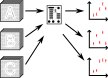

 <!-- .element width="1200px" -->

Script:
We've discussed in other videos the importance of sharing data openly. But to fully understand the process by which the results in a paper were obtained, the data alone aren't enough. The analysis stage involves many small decisions that are too detailed to be included in a paper; in another video we'll discuss why encoding these in code is important, and how you go about automating this. For now, let's assume that you've already done this, so you have a workflow that takes in your raw data and metadata and outputs the plots, tables, and other results included in your paper. In this video, we'll discuss how to take this workflow and publish it. This is an important step so that the reader of your work can understand all of the work you present, and could reproduce it and apply it to their own work.

-

 <!-- .element height="150px" style="margin: 50px" -->  <!-- .element height="150px" style="margin: 50px" -->  <!-- .element height="150px" style="margin: 50px" -->  <!-- .element height="150px" style="margin: 50px" -->  <!-- .element height="150px" style="margin: 50px" -->

Script:
Many of the considerations for sharing workflows are the same as for sharing data. We want out workflows to be findable, accessible, interoperatble, and reusable, and we need to find an appropriate place to host the workflow. In this video we'll focus on the aspects that are specific to workflows&mdash;if you haven't already watched the video on data, you might want to go and watch that to understand the common aspects before continuing this one.

-

 <!-- .element width="600px" -->

 <!-- .element height="150px" style="margin: 75px" -->  <!-- .element height="150px" style="margin: 75px" -->  <!-- .element height="150px" style="margin: 75px" -->

<!-- GNU logo is CC BY-SA 2.0 Aurelio A Heckert -->

Script:
The first thing to note is that your workflow is a piece of software. Even if it is only a few lines of code, it should still be treated as software rather than as data or something else. As we discuss in the video on Open Software Development, software licensing has specific needs that aren't met by the Creative Commons licenses that you would use for data and papers. [click] Instead, you should use a dedicated software license such as the BSD, MIT, or GNU General Public License. For more detail on making this choice, you might want to go and watch the video on Open Software Development.

-

<table><tr><th style="text-align: center; padding-bottom: 80px;"></td><th style="text-align: center;"></td><th style="text-align: center;"></td></tr>
<tr style="font-size: 72px; text-align: center;"><td style="text-align: center;">❌</td><td style="text-align: center;">❌</td><td style="text-align: center;" class="fragment" data-fragment-index="2">✅</td></tr></table>

Script:
If you've watched the video on Open Software Development, or are familiar with it from other routes, you might think that a source code repository host like GitHub or GitLab would be a good place to share your workflows. Unfortunately, while they are excellent tools to use while actively developing your workflows, they have some specific problems that make them unsuitable for _publishing_ them. A publishing platform should make it possible to find resources months, years, or decades after the reference to them was written&mdash;if a paper written in 1980 refers to one written in 1950, provided your library has a copy or a relevant subscription, you can go to the journal and find the cited article, and if an article written in 2005 cites another paper by its DOI, then that link should still work today. Platforms like GitHub, however, make no guarantee that links will remain available&mdash;if you change your username, or rename the repository, then all existing links to it can break. Anyone reading your paper and wanting to follow the link to your workflow will instead have a dead link. Worse, there is no guarantee that repositories will remain available at all in the long term; in 2022 GitLab announced that repositories not under active development would be removed from their service. While they did later reverse that decision, it's clear that a service dedicated to retaining data is needed. [click] You can publish your workflows (and other software) in most of the same places that you can publish data. As we discussed in the open data video, Zenodo is an example of such a service, and has a specific integration to make it easier to generate a dataset from a specific GitHub commit. (There are also services more specifically tailored to workflows, but currently these are specific to disciplines that do not overlap with lattice.)

-

<!-- .element data-transition="slide-in fade-out" -->

 <!-- .element width="800px" --> 

Script:
Most frequently a publication will depend both on some volume of data and a workflow to analyse it. There is then a question of whether these should be published together in one record, [continued next slide]

-

<!-- .element data-transition="fade-in slide-out" -->

 <!-- .element width="800px" --> 

Script:
or separately as two citable objects. There are a couple of things to think about here.

-

 <!-- .element height="500px" -->

Script:
The first question is whether your data are much larger than your code. If you have hundreds of megabytes of data and a few kilobytes of code, then someone wanting to refer to the code may need to sift through a very large amount of data to get to it, or it might be unclear when assessing citations whether the data or the code was the valuable part of the work. In this case, it may be valuable to use two separate releases, one for data and one for code.

-

 <!-- .element height="500px" -->

Script:
Next, is the workflow you're publishing going to be useful outside of the single analysis you're presenting? If so, then publishing it separately will avoid carrying a lot of irrelevant data into a different piece of work.

-

 <!-- .element height="500px" -->

Script:
Otherwise, if the data volumes are small and similar to the volume of code, and the code is very specific to the single dataset, then publishing both together as a single output might be more appropriate.

-

 <!-- .element height="500px" -->

Script:
Finally, it's worth thinking as you work on your analyis whether any of the tools you're developing as part of it could be made more general and usable in other contexts. These can be split out into separate repositories, and packaged so that others can use them. This more modular design can make it easier for others to read the workflow for your publication, and will also make it easier for others to apply your techniques in their own work.
